# 容器

> 容器是一种基础工具；泛指任何可以用于容纳其他物品的工具，可以部分或完全封闭，被用于容纳、存储、运输物品；物体可以被防止在容器中，而容器则可以保护内容物；

## 由PaaS到Container

2013年2月，前Gluster的CEO Ben Golub和dotCloud的CEO Solomon Hykes坐在一起聊天时，Solomon谈到想把dotCloud内部使用的Container容器技术单独拿出来开源，然后围绕这个技术开一家新公司提供技术支持。28岁的Solomon在使用python开发dotCloud的PaaS云时发现，使用 LXC(Linux Container) 技术可以打破产品发布过程中应用开发工程师和系统工程师两者之间无法轻松协作发布产品的难题。这个Container容器技术可以把开发者从日常部署应用的繁杂工作中解脱出来，让开发者能专心写好程序；从系统工程师的角度来看也是一样，他们迫切需要从各种混乱的部署文档中解脱出来，让系统工程师专注在应用的水平扩展、稳定发布的解决方案上。他们越深入交谈，越觉得这是一次云技术的变革，紧接着在2013年3月Docker 0.1发布，拉开了基于云计算平台发布产品方式的变革序幕。

## 主机级虚拟化和容器级虚拟化

- 虚拟化目的：隔离进程，不影响其他进程，彼此之间不受影响。


### 主机级虚拟化（完整物理平台，VMwareStation）

- Type-I()
- Type-II(hostOS，vmware,workerstation)

为每一个封闭的实例，提供的是一个**从底层硬件开始一直到高层**的基础环境。也就意味着说我们每一个对应的虚拟机实例就拥有自己可视的，而且是隔离于其它实例的基础硬件，包括CPU,内存等等，所以它在硬件完成资源划分以后，提供给了我们每一个实例一个基础环境，使得我们每一个实例都得安装操作系统，从而就拥有自己的内核空间和用户空间，所以这么一来不当紧，做为当前实例的使用者，就得安装操作系统，提供环境，安装程序并提供配置文件，最终才可用服务。

主机级虚拟化，由于做了两级内核，虚拟机自己有一级，hypervisor会有**性能损耗**，但是**隔离性是非常好**的。但**过于重量级**。

### 容器级虚拟化

- CPU 可压缩机制（挂起等待）
- Mem 不可压缩机制
  - 大量占用内存，OOM kill掉 ——> 内核Control Groups, CGroups实现

为什么出现容器技术：
如果现在我打算在一台完全隔离的环境中，尽量不影响其它应用的情况下，安装一个tomcat。做为一个程序猿来讲，发部一个新程序就要运行在tomcat上测试下。这时候我提供给用户的仅仅是一个虚拟机，即便安装好操作系统，用户还得安装tomcat等，会非常麻烦，过程就感觉很重量。因为我们额外步骤会非常的多。所以这种虚拟化方式过于重量级，尤其在某些轻量级的需求面前它就显得欲发重量。所以在这种情况下就出现了容器技术。

容器技术：

用户空间仅仅运行用户进程而以，就不需要在主机级虚拟化技术上，它自己管理自己的内核，把虚拟出来的内核给剥离掉。给用户一个chroot环境，在这个虚根下，能够隔离和其它用户相关的用户环境。

在内核中的一个逻辑级别能够设置为隔离开来的区域，彼此之间互相不干扰，不影响的话。那么我们就可以做出来**仅在用户空间**，就能实现**隔离的组件**来。那这个在用户空间就能实现的**组件**就称为“**容器**”。每一个空间就称为一个容器，因为每一个空间都容纳了一堆的**进程和用户帐号文件**等等

将内核分为**多个空间**，然后每个空间能够提供一个完整意义上的**程序运行环境**，容纳了文件，系统和进程以及彼此间职离的一些组件。我们把这些技术称之为容器。

1. FreeBSD, jail 隔离技术
2. Linux, vserver(chroot)

## LXC

> LinuX Container - LXC

创建进程并保护其进程不被其他进程所干扰——容器

容器技术实现：**chroot+namespaces+cgroups**

- chroot, 根切换
- namespaces: 名称空间
- CGroups(Control): 控制组
  - blkio: 块设备IO
  - cpu: CPU
  - cpuacct: CPU资源使用报告
  - cpuset: 多处理器平台上的CPU集合(比例分配，核分配)
  - devices: 设备访问(启用一个用户空间对该光驱设备可资源分配)
  - freezer: 挂起或恢复任务
  - memory: 内存用量及报告
  - pref_event: 对cgroup中的任务进行统一性能测试
  - net_cls: cgroup 中的任务创建的数据报文的类型标识符

### Control Groups

- group1
- group1-1 自动拥有group1的拥有权限
- group1-2
- group2
- group2-1
- group3

- cgroups隔离性不如主机虚拟化，为了防止一个用户空间通过访问其他用户使用selinux技术加固用户空间的容器的边界。但大多数不启用其就技术。

- Linux内核级创建名称空间(namespaces)
  - 6个 namespace + chroot 实现容器技术

- 使用内核级的名称空间及时+chroot实现
- namespace()
  - clone() -> setns() 放置容器

### Linux Namespaces

- 虚拟机目的：隔离（测试环境、生产环境）
  - 运行mongodb服务，主机虚拟化运行两个内核，浪费资源

- 一个内核上实现多个用户空间
  - 用户空间（真特权） | 用户空间 | 用户空间
    - 各自有根文件系统、进程、管理、用户，按名称空间分割
    - 限制各个空间资源：CPU(可压缩性资源)，内存(内存耗完 **OOM**内存不足)等，按控制组
      - 内存：按照用户空间比例配置或单个用户空间最大分配资源
        - 3个用户空间内存分配: 1:2:1
        - 4个用户空间内存分配: 1:2:1
        - 单个用户空间最多可使用最大分配资源
  - OS
  - 硬件

| namespace | 系统调用参数   | 隔离内容                 | 内核版本
| --------- | -----------   | -------                      | ------ |
| UTS       | CLONE_NEWUTS  | 主机名和域名                  | 2.6.19 |
| PIC       | CLONE_NEWIPC  | 信号量、消息队列和共享内存     | 2.6.19 |
| PID       | CLONE_NEWPID  | 进程编号                      | 2.6.24 |
| Network   | CLONE_NEWNET  | 网络设备、网络栈、端口等       | 2.6.29 |
| Mount     | CLONE_NEWNS   | 挂载点(文件系统)              | 2.4.19 |
| User      | CLONE_NEWUSER | 用户和用户组                  | 3.8 |

- CentOS 6 不支持 Docker，内核2.6

### 安装 LXC

> lxc-templates

基于模板，就是脚本，这个脚本创建名称空间以后自动执行，在脚本执行环境。这个脚本自动的去实现安装过程。这个安装
指向了你说打算创建那个类的名称空间系统发行版所属的仓库，从仓库中拉取下载各种包进行安装，生成这个行的名称空间。这个名称空间就像虚拟机一样可以使用。

在子目录执行脚本并创建名称空间，然后chroot，就可以拥有虚拟机了

**epel仓库**

``` sh
# yum clean all
# yum repolist
# yum info lxc
# yum -y install lxc lxc-templates
# rpm -ql lxc
# lxc-checkconfig
# rpm -ql lxc-templates

# lxc-create -h
# cd /etc/sysconfig/network-scripts/
# cp ifcfg-eno16777736 ifcfg-virbr0
```

**创建物理桥**

``` sh
# vim ifcfg-virbr0
  UUID 删除
  DEVICE=virbr0
  TYPE=bridge
  name="System virbr0" 或删除

# vim ifcfg-eno16777736
  删除地址:IP,NETMASK,GATEWAY,DNS
  BRIDGE=virbr0

# systemctl restart network.servie
```

**创建容器**

``` shell
# lxc-create -h
# cd /usr/share/lxc/templates/
# cp lxc-centos{,.bak}
# vim lxc-centos
  [base]
  #mirrorlist
  baseurl=http://172.18.0.1/cobbler/ks_mirror/7/

  [updates]
  enables=0

# lxc-create -n centos7 -t centos
# chroot /var/lib/lxc/centos7/rootfs passwd
# ls /var/lib/lxc/centos7
```

**运行容器**

``` shell
# lxc-start -n centos7
  centos7 login: root
# ifconfig
# ip a l
# cd /etc/yum.repo.d/CentOS7-base.repo
  baseurl=http://172.18.0.1/cobbler/ks_mirror/7/
  [updates]
  enable=0
  [extra]
  enable=0

# yum repolist
# yum -y install net-tools
# ss -tunl
```

**ssh远程登录**

``` sh
# lxc-info -n centos7
# lxc-top
# lxc-monitor -n centos7

# lxc-freeze -n centos7 暂停在内存中
# lxc-unfreeze -n centos7

# lxc-stop -n centos7 正常关机

# lxc-start -n centos7 -d

# lxc-console -h

# lxc-attch -h


# lxc-start -n centos7 -d
# ps aux
# laxc-info -n centos7
# lxc-attach -n centos7 -t 0
# lxc-console -n centos7 -t 0
ctrl+a,q

- 检查系统环境是否满足容器使用要求
  lxc-checkconfig
- 创建lxc容器
  lxc-create -n NAME -t TEMPLATE_NAME
- 启动容器
  lxc-start -n NAME -d
- 查看容器相关的信息
  lxc-info NAME
- 附加至指定容器的控制台
  lxc-console -n NAME -t NUMBER
    NUMBER:
      0: 物理控制台
      1: tty1
      2: tty2
      ...
  Ctrl+a,q

- 停止容器
  lxc-stop -n NAME
- 删除处于停机状态的容器
  lxc-destroy -n centos7

- 列出快照
  lxc-snapshot -n centos7 -L
- 创建快照
  lxc-snapshot -n centos7

- 恢复快照
  lxc-snapshot -n centos7 -r snap1
- 删除快照
  lxc-snapshot -n centos7 -d snap0

- 克隆
  lxc-clone -s centos7 centos7-clone 
  overlayfs: error mouting...

# yum -y install git
# git clone https://github.com/lxc-webpanel/LXC-Web-Panel.git
# cd LXC-Web-Panel/
# yum list all | grep flask
# yum -y install python-flask
  repo源, enable=1
# python ./lwp.py
# ss -tnl
  admin:admin
```

## OCI

> Open Container Initiative

- Linux基金会主导与2015年6月创立
- 围绕容器格式和运行时机制顶一个开放的工业化标准

- contains two specifications
  - The **Runtime** Specifications(runtime-spec)
  - The **Image** Specifications(image-spec)

- The Runtie Specification outlines how to run a "filesystem bundle" that is unpacked on disk
- At a high-level an OCI implementation would download an OCI Image then unpack that image into an OCI Runtime filesystem bundle.

## runC

OCF: Open Container Format(开发容器格式)

- runC(实现的) is a CLI tool for spawning and running container according to the OCI specification

## Docker

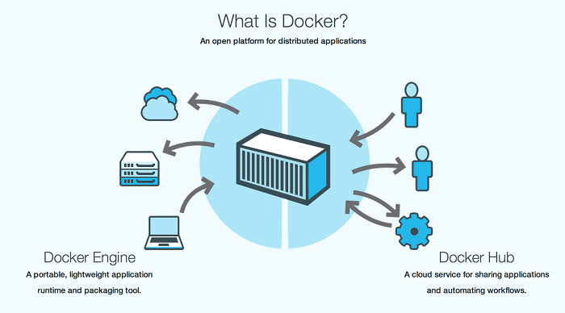

Docker 是 Docker.Inc 公司开源的一个基于 LXC技术之上构建的Container容器引擎， 源代码托管在 GitHub 上, 基于Go语言并遵从Apache2.0协议开源。 Docker在2014年6月召开DockerConf 2014技术大会吸引了IBM、Google、RedHat等业界知名公司的关注和技术支持，无论是从 GitHub 上的代码活跃度，还是Redhat宣布在RHEL7中正式支持Docker, 都给业界一个信号，这是一项创新型的技术解决方案。 就连 Google 公司的 Compute Engine 也支持 docker 在其之上运行, 国内“BAT”先锋企业百度Baidu App Engine(BAE)平台也是以Docker作为其PaaS云基础。

### Docker产生的目的就是为了解决以下问题

1) 环境管理复杂: 从各种OS到各种中间件再到各种App，一款产品能够成功发布，作为开发者需要关心的东西太多，且难于管理，这个问题在软件行业中普遍存在并需要直接面对。Docker可以简化部署多种应用实例工作，比如Web应用、后台应用、数据库应用、大数据应用比如Hadoop集群、消息队列等等都可以打包成一个Image部署。如图所示：


2) 云计算时代的到来: AWS的成功, 引导开发者将应用转移到云上, 解决了硬件管理的问题，然而软件配置和管理相关的问题依然存在 (AWS cloudformation是这个方向的业界标准, 样例模板可参考这里)。Docker的出现正好能帮助软件开发者开阔思路，尝试新的软件管理方法来解决这个问题。

3) 虚拟化手段的变化: 云时代采用标配硬件来降低成本，采用虚拟化手段来满足用户按需分配的资源需求以及保证可用性和隔离性。然而无论是KVM还是Xen，在 Docker 看来都在浪费资源，因为用户需要的是高效运行环境而非OS, GuestOS既浪费资源又难于管理, 更加轻量级的LXC更加灵活和快速。如图所示：


4) LXC的便携性: LXC在 Linux 2.6 的 Kernel 里就已经存在了，但是其设计之初并非为云计算考虑的，缺少标准化的描述手段和容器的可便携性，决定其构建出的环境难于分发和标准化管理(相对于KVM之类image和snapshot的概念)。Docker就在这个问题上做出了实质性的创新方法。

### 核心技术预览

Docker核心是一个操作系统级虚拟化方法, 理解起来可能并不像VM那样直观。我们从虚拟化方法的四个方面：隔离性、可配额/可度量、便携性、安全性来详细介绍Docker的技术细节。


2.1. 隔离性: Linux Namespace(ns)

每个用户实例之间相互隔离, 互不影响。 一般的硬件虚拟化方法给出的方法是VM，而LXC给出的方法是container，更细一点讲就是kernel namespace。其中pid、net、ipc、mnt、uts、user等namespace将container的进程、网络、消息、文件系统、UTS("UNIX Time-sharing System")和用户空间隔离开。

1) pid namespace

不同用户的进程就是通过pid namespace隔离开的，且不同 namespace 中可以有相同pid。所有的LXC进程在docker中的父进程为docker进程，每个lxc进程具有不同的namespace。同时由于允许嵌套，因此可以很方便的实现 Docker in Docker。

2) net namespace

有了 pid namespace, 每个namespace中的pid能够相互隔离，但是网络端口还是共享host的端口。网络隔离是通过net namespace实现的， 每个net namespace有独立的 network devices, IP addresses, IP routing tables, /proc/net 目录。这样每个container的网络就能隔离开来。docker默认采用veth的方式将container中的虚拟网卡同host上的一个docker bridge: docker0连接在一起。

3) ipc namespace

container中进程交互还是采用linux常见的进程间交互方法(interprocess communication - IPC), 包括常见的信号量、消息队列和共享内存。然而同 VM 不同的是，container 的进程间交互实际上还是host上具有相同pid namespace中的进程间交互，因此需要在IPC资源申请时加入namespace信息 - 每个IPC资源有一个唯一的 32 位 ID。

4) mnt namespace

类似chroot，将一个进程放到一个特定的目录执行。mnt namespace允许不同namespace的进程看到的文件结构不同，这样每个 namespace 中的进程所看到的文件目录就被隔离开了。同chroot不同，每个namespace中的container在/proc/mounts的信息只包含所在namespace的mount point。

5) uts namespace

UTS("UNIX Time-sharing System") namespace允许每个container拥有独立的hostname和domain name, 使其在网络上可以被视作一个独立的节点而非Host上的一个进程。

6) user namespace

每个container可以有不同的 user 和 group id, 也就是说可以在container内部用container内部的用户执行程序而非Host上的用户。

2.2 可配额/可度量 - Control Groups (cgroups)

cgroups 实现了对资源的配额和度量。 cgroups 的使用非常简单，提供类似文件的接口，在 /cgroup目录下新建一个文件夹即可新建一个group，在此文件夹中新建task文件，并将pid写入该文件，即可实现对该进程的资源控制。groups可以限制blkio、cpu、cpuacct、cpuset、devices、freezer、memory、net_cls、ns九大子系统的资源，以下是每个子系统的详细说明：

blkio 这个子系统设置限制每个块设备的输入输出控制。例如:磁盘，光盘以及usb等等。

cpu 这个子系统使用调度程序为cgroup任务提供cpu的访问。

cpuacct 产生cgroup任务的cpu资源报告。

cpuset 如果是多核心的cpu，这个子系统会为cgroup任务分配单独的cpu和内存。

devices 允许或拒绝cgroup任务对设备的访问。

freezer 暂停和恢复cgroup任务。

memory 设置每个cgroup的内存限制以及产生内存资源报告。

net_cls 标记每个网络包以供cgroup方便使用。

ns 名称空间子系统。

以上九个子系统之间也存在着一定的关系.详情请参阅官方文档。

2.3 便携性: AUFS

AUFS (AnotherUnionFS) 是一种 Union FS, 简单来说就是支持将不同目录挂载到同一个虚拟文件系统下(unite several directories into a single virtual filesystem)的文件系统, 更进一步的理解, AUFS支持为每一个成员目录(类似Git Branch)设定readonly、readwrite 和 whiteout-able 权限, 同时 AUFS 里有一个类似分层的概念, 对 readonly 权限的 branch 可以逻辑上进行修改(增量地, 不影响 readonly 部分的)。通常 Union FS 有两个用途, 一方面可以实现不借助 LVM、RAID 将多个disk挂到同一个目录下, 另一个更常用的就是将一个 readonly 的 branch 和一个 writeable 的 branch 联合在一起，Live CD正是基于此方法可以允许在 OS image 不变的基础上允许用户在其上进行一些写操作。Docker 在 AUFS 上构建的 container image 也正是如此，接下来我们从启动 container 中的 linux 为例来介绍 docker 对AUFS特性的运用。

典型的启动Linux运行需要两个FS: bootfs + rootfs:


bootfs (boot file system) 主要包含 bootloader 和 kernel, bootloader主要是引导加载kernel, 当boot成功后 kernel 被加载到内存中后 bootfs就被umount了. rootfs (root file system) 包含的就是典型 Linux 系统中的 /dev, /proc,/bin, /etc 等标准目录和文件。

对于不同的linux发行版, bootfs基本是一致的, 但rootfs会有差别, 因此不同的发行版可以公用bootfs 如下图:

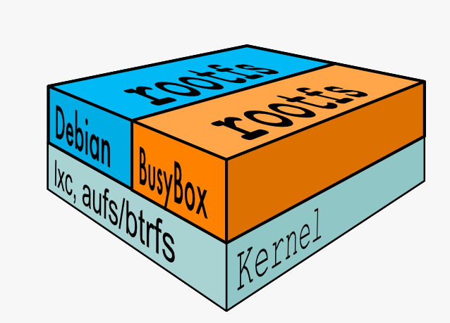

典型的Linux在启动后，首先将 rootfs 设置为 readonly, 进行一系列检查, 然后将其切换为 "readwrite" 供用户使用。在Docker中，初始化时也是将 rootfs 以readonly方式加载并检查，然而接下来利用 union mount 的方式将一个 readwrite 文件系统挂载在 readonly 的rootfs之上，并且允许再次将下层的 FS(file system) 设定为readonly 并且向上叠加, 这样一组readonly和一个writeable的结构构成一个container的运行时态, 每一个FS被称作一个FS层。如下图:


得益于AUFS的特性, 每一个对readonly层文件/目录的修改都只会存在于上层的writeable层中。这样由于不存在竞争, 多个container可以共享readonly的FS层。 所以Docker将readonly的FS层称作 "image" - 对于container而言整个rootfs都是read-write的，但事实上所有的修改都写入最上层的writeable层中, image不保存用户状态，只用于模板、新建和复制使用。

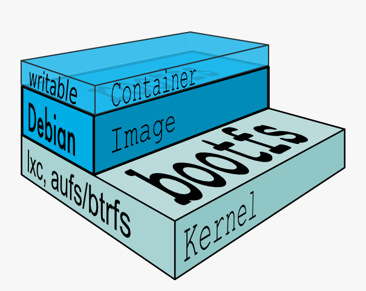

上层的image依赖下层的image，因此Docker中把下层的image称作父image，没有父image的image称作base image。因此想要从一个image启动一个container，Docker会先加载这个image和依赖的父images以及base image，用户的进程运行在writeable的layer中。所有parent image中的数据信息以及 ID、网络和lxc管理的资源限制等具体container的配置，构成一个Docker概念上的container。如下图:

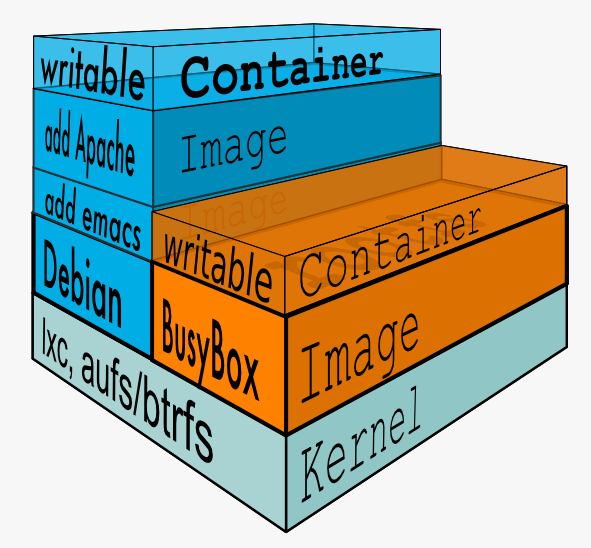

2.4 安全性: AppArmor, SELinux, GRSEC

安全永远是相对的，这里有三个方面可以考虑Docker的安全特性:

由kernel namespaces和cgroups实现的Linux系统固有的安全标准;

Docker Deamon的安全接口;

Linux本身的安全加固解决方案,类如AppArmor, SELinux;

由于安全属于非常具体的技术，这里不在赘述，请直接参阅Docker官方文档。

3. 最新子项目介绍

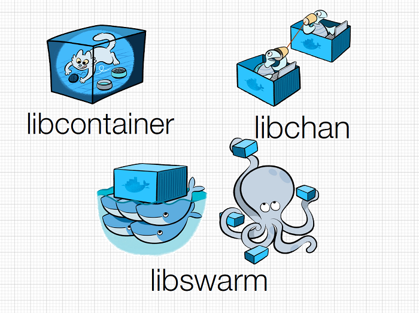

我们再来看看Docker社区还有哪些子项目值得我们去好好研究和学习。基于这个目的，我把有趣的核心项目给大家罗列出来，让热心的读者能快速跟进自己感兴趣的项目:

Libswarm，是Solomon Hykes (Docker的CTO) 在DockerCon 2014峰会上向社区介绍的新“乐高积木”工具: 它是用来统一分布式系统的网络接口的API。Libswarm要解决的问题是，基于Docker构建的分布式应用已经催生了多个基于Docker的服务发现(Serivce Discovery)项目，例如etcd, fleet, geard, mesos, shipyard, serf等等，每一套解决方案都有自己的通讯协议和使用方法，使用其中的任意一款都会局限在某一个特定的技术范围內。所以Docker的CTO就想用libswarm暴露出通用的API接口给分布式系统使用，打破既定的协议限制。目前项目还在早期发展阶段，值得参与。

Libchan，是一个底层的网络库，为上层 Libswarm 提供支持。相当于给Docker加上了ZeroMQ或RabbitMQ，这里自己实现网络库的好处是对Docker做了特别优化，更加轻量级。一般开发者不会直接用到它，大家更多的还是使用Libswarm来和容器交互。喜欢底层实现的网络工程师可能对此感兴趣，不妨一看。

Libcontainer，Docker技术的核心部分，单独列出来也是因为这一块的功能相对独立，功能代码的迭代升级非常快。想了解Docker最新的支持特性应该多关注这个模块。


[docker镜像源](https://hub.docker.com)

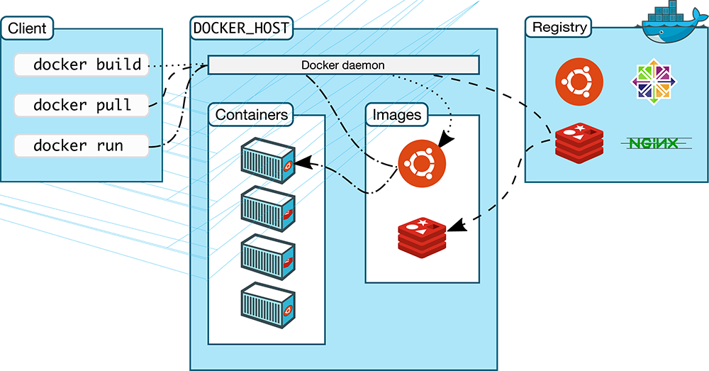

- Client
  - docker build
  - docker pull
  - docker run
- DOCKER_HOST
  - Docker daemon (守护进程)
    - ipv4
    - ipv5
    - unix sock file
  - Images(从Registry下载镜像)
    - Ubuntu
    - Redis
  - Containers
    - 容器1
    - 容器2
    - 容器3

- 为了加速下载镜像，

- 基于LXC的二次封装发行版的增强版
- Docker的只能运行一个进程，docker没有init
- 主要为了实现，进程的**分发**和**部署**
- LNMP要运行三个Docker
- docker -> moby
- Docker-CE
- Docker-EE

一个OS用户空间所需要的所有组件事先准备编排好以后整体打包成一个文件，这个文件就是镜像文件。此镜像文件存放在集中仓库内。比如：UbuntOS镜像，Nginx镜像。创建容器的时候，不会激活模板安装，会链接镜像服务器上加载匹配你的创建容器所需要的镜像拖到本地，基于镜像来启动容器，所以socker极大的简化了容器的难度。一个容器内只能运行一个进程。监控运行程序必须在容器里安装才能调试进程，容器对于开发人员极大地便利，但对于运维不便利。

在CentOS/Ubuntu/OpenSuSE 开发适用于每一种OS的软件，每个OS的配置文件都不一样。但docker有自己的文件系统和用户管理不同考虑OS的不同配置等。

docker中的容器

- 运行环境: lxc->libcontainer->runC

- OCL(Oopen Container Initiative)规范

批量创建容器

- 镜像构建：分层构建，联合挂在实现

- nginx(挂载) | apache(挂载) | tomcat(挂载)
- 挂载数据存储（另外一个服务器独立存放的数据服务器）

- 镜像层
  - nginx(只读的) | apache(只读的) | tomcat(只读的)
  - centos(底层共享，只读)

- 编排工具
  - nmp
  - machine+swarm+compose
  - mesos + maratbon(统一资源调度)
  - kubernetes -> k8s
  - libcontainer->runC(容器运行时的环境标准，工业标准)

- Moby(Enterprise Docker)
- CNCF(google,IBM) 另外一个docker

### Docker architecture

- Docker objects
  - images
  - containers
  - networks
  - volumes
- Docker client
- Docker registries
  - 镜像存储的仓库
  - 用户认证
  - 一个仓库(nginx)只有一个应用程序的镜像(包含多个标签，nginx:1.15,  nginx:stable, nginx:latest)
  - 镜像：静态
  - 容器：动态，声明周期
  - 镜像与容器是程序与进程的关系

### 安装及使用Docker

- 依赖的基础环境
  - 64 bits CPU
  - Linux Kernel 3.10+
  - Linux Kernel cgroups and namespace
- CentOS 7
  - "extras" repository
  - `/etc/yum.repos.d/extras`

- Docker Daemon
  - `systemctl start docker.service`
- Docker Client
  - `docker [options] COMMAND [arg...]`

- extras源: `docker`
- 自定义源: `docker-ce`

- 常用操作
  - docker search: Search the Docker Hub for images
  - docker pull: Pull an image or a repository from a registry
  - docker images: List images
  - docker create: Create a new container
  - docker start: Start one or more stopped containers
  - docker run: Run a command in a new container
  - docker attach: Attach to a running container
  - docker ps: List containers
  - docker logs: Fetch the logs of a container
  - docker restart: Restart a container
  - docker stop: Stop one or more running containers
  - docker kill: Kill one or more running containers
  - docker rm: Remove one or more containers

#### 1. 修改yum源

``` sh

# cd /etc/yum.repos.d

下载配置文件
# wget https://mirrors.tuna.tsinghua.edu.cn/docker-ce/linux/centos/docker-ce.repo
# vim docker-ce.repo
:%s@https://download.docker.com@https://mirrors.tuna.tsinghua.edu.cn/docker-ce
# yum repolist


启用[extras]源 使用docker, 上面镜像使用docker-ce
# yum info docker-ce
# yum -y install docker-ce
# ifconfig

镜像加速器
# vim /etc/docker/daemon.json
  {
    "registry-mirrors": ["https://registry.docker-cn.com"]
  }


docker帮助
# docker
# docker container --help
# docker version
# docker info

docker info报错docker bridge-nf-call-iptables is disabled解决办法

在CentOS中
# vim /etc/sysctl.conf
net.bridge.bridge-nf-call-ip6tables = 1
net.bridge.bridge-nf-call-iptables = 1
net.bridge.bridge-nf-call-arptables = 1

# systemctl start docker.service
# ifconfig
  docker0: 172.17.0.1
# iptables -t nat -vnL
```

#### 2. 镜像文件

[HubDocker](https://hub.docker.com)

``` sh
# docker search centos
  CIAL AUTOMATED
  nginx 顶级仓库/官方仓库
  jwilder/nginx-proxy 个人用户仓库

  alpine: 微型发行版，空间小，缺少调试的工具

  docker.io docker.io/centos 官方镜像

- 拉取nginx-alpine镜像
# docker [image] pull NAME[:tag]
# docker image pull nginx:1.14-alpine
# docker image pull nginx:1.14-alpine

- 刪除镜像
# docker rmi busybox

- 显示本地镜像列表
# docker images ls
# docker image ls --help

- 拉取centos，默认7
# docker pull centos

- 拉取centos6
# docker pull centos:6
```

#### 3. 容器操作 - docker container

``` sh
- 创建容器
# docker container ls
# docker container create

- 创建并启动
# docker [container] run --help
# docker [container] run [OPTIONS] IMAGE [COMMAND] [ARG...]
# docker [container] run --name c1 -it centos:latest /bin/bash

-it 交互式启动busybox
#docker run --name b1 -it busybox:latest

# mkdir /data/html -p
# vi /data/html/index.html
# httpd -f -h /data/html/
Ctrl+c 退出 httpd
# exit 退出shell，即退出容器（停止容器状态）
# docker ps -a
# docker container ls -a

激活停止的容器(attach,interactive)
# docker container start -i -a b1
# docker kill (强制终止) 不推荐强制终止
# docker ps -a
# docker container rm b1 (停止的容器，可以删除容器)
# docker ps -a

打开终端
# docker ps
# docker inspect b1
# curl 172.17.0.2 两个虚拟机之间通信

启动nginx(没有下载镜像会自动从docker镜像站下载镜像) -d：detach(分离) 后台
# docker container run --name web1 -d nginx:1.14-alpine

打开终端
# curl 172.17.0.2

启动redis
# docker run --name kvstor1 -d redis:4-alpine

在容器中运行客户端命令
# docker container exec -it kvstor1 /bin/sh
# ps
# netstat -tnl
# redis-cli
> keys
> SELECT 1
> exit
/data # exit

查看日志
# docker container logs web1

查看网络
# docker network ls
# ifconfig
  docker0: 172.17.0.1 net桥(地址转换)

- 安装网络查看工具
# yum -y install net-tools
# ifconfig
  172.17.0.2

- 脱离终端
# Ctrl+p,Ctrl+q

- 查看运行容器
# docker ps
# docker ps -a

- 停止容器
# docker stop c1
# docker ps

- 删除容器
# docker rm c1
# docker rm -f c1

docker run= docker create + docker start

- Docker Image Layer
  - writeable | Container
  - add Nginx | Image
  - add net-tools | Image
  - CentOS Base | Image
  - bootts
  - kernel
```

### docker 组件

- docker程序环境
  - 环境配置文件
    - /etc/sysconfig/docker-network
    - /etc/sysconfnig/docker-storage
    - /etc/sysconfig/docker

  - Unit File
    - /usr/lib/systemd/system/docker.service
  - Docker REgistry 配置文件
    - /etc/containers/registries.conf
  - docker-ce
    - 配置文件：`/etc/docker/daemon.json`
      - {"registry-mirrors": ["https://registry.docker-cn.com"]}

- Docker镜像加速
  - docker cn
  - 阿里云加速器
  - 中国科技大学

- 注册阿里云账号，专用加速器地址获得路径
  - https://cr.console.aliyun.com/#/accelerator

- 物理：client <--> Daemon <--> Registry Server
- 逻辑
  - Containers

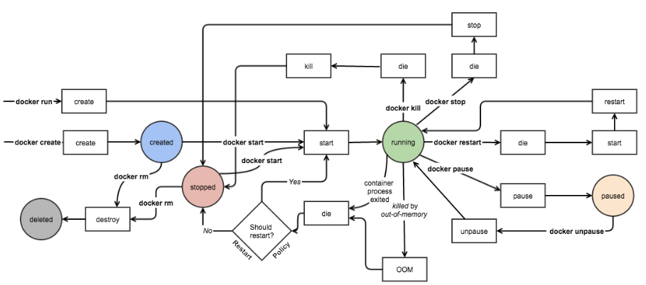

## docker镜像管理基础

### docker 架构

docker host运行docker daemon(守护进程)的主机。docker daemon接受客户端请求通过http或https协议与客户端交互，客户端主机可以是远程主机（docker creat,docker run都是客户端命令）
docker daemon 接收到 docker create 创建容器，docker run 启动容器的命令。一个 docker host 可以启动多个容器，即运行多个应用程序。而容器的运行时基于镜像来实现的。如果镜像本地没有，docker daemon 会自动连到 docker registries上从中获取镜像，先把镜像存储在本地存储镜像空间中。这个镜像空间是专有的文件系统(overlay2)。镜像是只读的。仓库名是应用程序名，而仓库内可以放置多个镜像，而多个镜像是同一个应用程序的多个版本。可以用标签来识别镜像。镜像就是应用程序的集装箱。

Docker? 码头工人，装卸集装箱。

### About Docker Images

Docker 镜像含有启动容器所需要的**文件系统**及其内容，因此，其用于创建并启动 docker容器

采用**分层构建机制**，最底层为**bootfs**, 其之为 **rootfs**


- bootfs: **用于系统引导的文件系统**，包括 bootloader和kernel，容器启动完成后会**被卸载**以节约内存资源
- rootfs: 位于 bootfs 之上，表现为docker容器的**根文件系统**
  - 传统的模式中，系统启动之时，内核挂在rootfs时会首先将其挂载为“只读”模式，完整性自检完成后将其重新挂载为读写模式
  - docker中，rootfs有内核挂载为“只读”模式，而后通过“联合挂载”技术额外挂载一个“可写”层

### Docker Image Layer

- 位于下层的镜像称为父镜像（parent image），最底层的称为基础基础镜像（base image）
- 最上层为“可读写”层，其下层为“只读”层


Apache镜像在底层最基础纯净的，最小化的系统镜像上添加编辑器emacs,每添加一个都是一个独立的镜像，bootfs容器启动时，被rootfs引导完成之后再内存中移除。所以，真正的用户空间在只有三层，且彼此之间有层级关系。Base Image构建系统的基本构成。添加一个emacs程序就在系统层之上创建新的层。在emacs层上创建nginx应用程序。启动nginx应用程序，必须三层都启动起来。先启动底层，挂载。在底层挂载基础之上，挂载第二层，然后挂载第三层，叠加在一起挂载。所以我们叫做**联合挂载**。这三层都是只读的，如果某个进程创建临时文件，再创建可以编写的层，可供底下各个层可共享的层。所有写操作都在writable层次上实现。删除了容器，writable会被删除的（docker container rm）。删除容器之后，该容器层的可写层一并被删除。

### Aufs

镜像的**分层构建**和**联合挂载**依赖于**文件系统**的支撑才能实现。早起使用Aufs文件系统实现。

- Advanced multi-layered unification filesystem 高级多层统一文件系统
- 用于为Linux文件系统实现“联合挂载”
- aufs是之前的**UnionFS**的重新实现，2006年由Junjiro Okajima开发
- Docker最初使用aufs作为容器文件系统层，它目前仍作为存储后端之一来支持
- aufs的竞争产品是**overlayfs**(叠加文件系统)，后者自从**3.18版本**开始被合并到**Linux内核**
- docker的分层镜像，除了aufs，docker还支持**btrfs, devicemappper(dm)和vfs**等
  - 在Ubuntu系统下，docker默认**Ubuntu**的**aufs**; 而在**CentOS7**上，用的是**devicemapper**

``` sh
# docker info
  Storage Driver: overlay2 是抽象的二级文件系统（前段）
    Backing Filesystem: xfs
```

### Docker Registry

> 镜像统一存储的位置

启动容器时，docker daemon会试图从本地获取相关的镜像；本地镜像不存在时，其将从Registry中下载该镜像并保存到本地。没有特别指定registry 默认docker hub。指明访问地址，指明的地址下载registry。

The Registry is a stateless, highly scalable server side application that stores and lets you distribute Docker images.

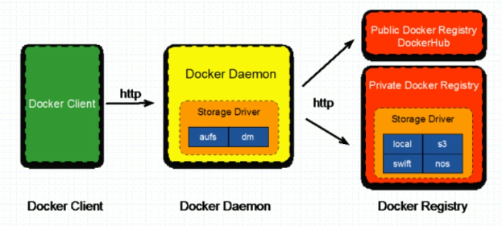

harbor

### docker Registry 分类

- Registry用于保存 docker 镜像，包括镜像的层次结构和元数据
- 用户可自建 Registry，也可使用官方的 Docker Hub
- 分类
  - Sponsor Registry: 第三方的 registry, 供客户和Docker社区使用
  - Mirror Registry(aliyun,docker-cn): 第三方的 registry, 只让客户使用
  - Vendor Registry(买了Redhat OS客户使用): 由发布Docker镜像的供应商提供的 registry
  - Private Registry: 通过设有防火墙和额外的安全层的私有实体提供的registry
    - 不消耗互联网带宽

### Registry(repository and index)

- Repository
  - 有某特定的docker镜像的所有迭代版本组成镜像仓库
  - 一个 Registry中可以存在多个 Repository
    - Repository可分为"顶层仓库"和“用户仓库”
    - 用户仓库名称格式为“用户名/仓库名”
  - 每个仓库可以包含多个Tag（标签），每个标签对应一个镜像
- Index
  - 维护用户账户、镜像的校验以及公共命名空降的信息
  - 相当于为 Registry 提供了一个完成用户认证等功能的检索接口

### Docker Registry

Docker Registry中的镜像通常有开发人员制作，而后推送至“公共”或“私有” Registry上保存，共其他人员使用，例如“部署”到生产环境

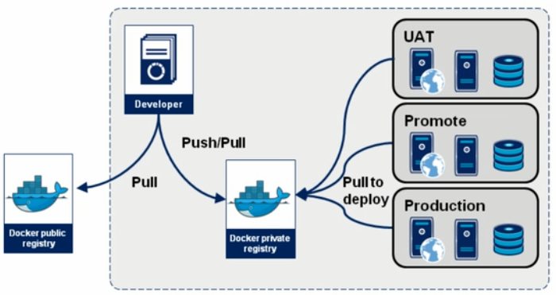

开发人员在从Public或Private 拉去镜像额外的修改并生成新的层次的镜像，把此镜像推送到自己私有的仓库中去。而后，由我们的运维人员所使用。把此镜像拖到服务器上完成部署并启动。不同镜像他们配置所不同。有可能会有不同配置的同一个镜像。

Cloud Native(云原生)：面向云环境的运行的程序，调用云系统本身既有的功能而开发的应用程序。

程序员写程序是针对某个开发环境编写程序。比如：编写C程序针对C开发环境编写。系统级开发，针对系统库编程接口，写了C程序的系统调用库或第三方库当中库文件去生成自己的代码。此代码会运行在系统级的环境之上。

早起容器**配置文件**通过启动容器时传入**环境变量**，容器启动时从环境变量获取自动注入到配置文件中。

### Docker Hub

- **Image Repositories** 镜像仓库(个人账号)
  - Find and pull images from community and official libraries, and manage, push to, and pull from private image libraries to which you have access.
- **Automated Builds** 自动构建(commit构建新的镜像,yum install操作做成镜像)
  - Automatically create new images when you make changes to a source code repository.
    - Github
      - project, dockerfile 文件推送到github仓库中，与docker hub仓库产生关联关系。而Docker hub 仓库可以持续监控Github的仓库的dockerfile文件，Docker hub拉取dockerfile文件自动做成镜像并放在仓库中。制作新的镜像文件，在开发主机上修改dockerfile文件并推送到github仓库中。github的仓库中改动，dockerhub自动拉取改动的dockerfile做成新的镜像。
- **Webhooks**
  - A feature of Automated Builds, Webhooks let you trigger actions after a sucessful push to a repository.
    - 在开发服务器上修改之后推送到Github，Github的变动通知Dockerhub, Dockerhub会拉取自动构建镜像。
- Organizations
  - Create work groups to manage access to image repositories.
- GitHub and Bitbucket Integration
  - Add the Hub and your Docker iamges to your current workflows

### Getting images from remote Docker registries

`# docker pull <registry>[:<port>]/[<namespace>/]<name>:<tag>`

- `<registry>[:<port>]/` 不设置此项，默认为Dockerhub
- `<namespace>`
  - Namespace : Exampmle(<namespace>/<name>)
    - organization : redhat/kubernetes, google/kubernetes
    - login(user name): alice/application, bob/application
    - role: devel/database, test/database, prod/database

### 仓库服务器

- [quay.io](https://quay.io)
  - flannel

``` sh
# docker pull quay.io/coreos/flannel:v0.10.0-amd64
# docker image ls
```

### 制作镜像

- 镜像的生成途径
  - Dockerfile
  - 基于容器制作
    - 容器的最上层的可写成单独做成镜像层
  - Docker Hub automated builds
    - 基于Dockerfile

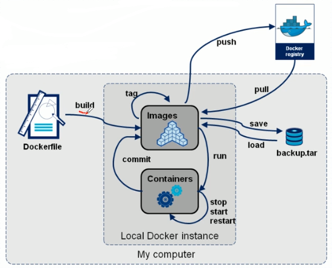

#### 基于容器制作镜像

- Create a new image from a container's changes
- Usage
  - docker commit [OPTIONS] CONTAINER [REPOSITORY[:TAG]]

``` sh
# docker run --name b1 -it busybox
/ # mkdir -p /data/html
/ # vi /data/html/index.html
  <h1>Busybox httpd server.</h1>
......

开启新的ssh
# docker commit -h

暂停docker并制作镜像
# docker commit -p b1

标签
# docker tag --help

默认执行busybox的默认命令
# docker tag 758ec7f3a1ee wovert/httpd:v0.1-1

一个镜像有多个标签
# docker tag wovert/httpd:v0.1-1 wovert/httpd:latest

删除一个标签(删除一个引用)
# docker image rm wovert/httpd:latest

# docker inspect busybox
  "Cmd": 默认执行的命令
# docker inspect nginx:1.14-alpine
# docker inspect wovert/httpd:v0.1-1

# docker run --name t1 -it wovert/httpd:v0.1-1
/ # ls /
/ # ls /data/html
/ # cat /data/html/index.html

暂停docker并制作镜像并打标签, 默认运行httpd
# docker commit -a "wovert <wovert@126.com>" -c 'CMD ["/bin/httpd", "-f", "-h", "/data/html"]' -p b1 wovert/httpd:v0.2
# docker image ls

基于v0.2 启动镜像
# docker run --name t3 wovet/http:v0.2

# docker container ls
# docker inspect t3
# curl 192.17.0.5
```

### 推送仓库

1. 创建仓库：wovert/httpd

2. 推送仓库

``` sh
# docker image push --help

登录 dockerhub
# docker login --help
# docker login -u wovert

推送
# docker push wovert/httpd

拉取
# docker pull wovert/httpd:v0.2

```

### 阿里云镜像推送

服务器名/名称空间/仓库名

1. vim /etc/docker/daemon.json
{
  "registry-mirrors": ["https://mglzycoz.mirror.aliyuncs.com","https://registry.docker-cn.com"]
}

2. 打标签: `# docker tag wovert/httpd:v0.2 registry.cn-qingdao.aliyuncs.com/wovert/httpd:v0.2`

3. 推送:  `docker login --username=ap1283g8i@aliyun.com registry.cn-qingdao.aliyuncs.com`

注意：在阿里云设置Registry登录密码

### 镜像导入导出

- docker save 保存打包
  - Save one or more iamges to a tar archive(streamed to STDOUT by default)
  - Usage: `docker save [OPTIONS] IMAGE [IMAGE...]`
    - `--output, -o: Write to a file, instead of STDOUT`
- docker load 装入
  - Load an image from a tar archive or STDIN
  - Usage: doker load [OPTIONS]
    - `--input, -i: Read from tar archive file, instead of STDIN`
    - `--quiet, -q: Suppress the load output`

- 案例：测试docker镜像，已有的镜像服务器上打包压缩，在另外一个服务器上解压装入

``` sh
Node1服务器上
# hostnamectl set-hostname node1
[root@node1 ~]# docker save --help
[root@node1 ~]# docker save -o myimages.gz wovert/httpd:v0.1-1 wovert/httpd:v0.2
[root@node1 ~]# scp myiamges.gz node02:/root/


Node2服务器上
[root@node2 ~]# docker load -i myimages.gz
[root@node2 ~]# docker image ls
```

## 容器虚拟化网络

- Linux 2.6支持：6种名称空间：UTS(主机名+域名)， User, Mount, IPC, Pid, Net

- 一个名称空间只能使用一个设备（网卡），四个名称空间使用四个网卡设备

- 名称空间数量超过了物理设备数量，可以使用软件方式模拟物理设备。

- 在名称空间中用软件模拟构建网卡，同时在交换机上构建虚拟网卡。

OVS： OpenVSwitch, SDN

### 案例

同一个物理机上创建两个容器（C1，C2）彼此之间通信，在此物理机上创建虚拟(软)交换机。两个容器各自用纯软件的方式建一对儿网卡（一个在容器上，另一个在虚拟交换机S1上），彼此之间建立网络通信构成一个网段。之后，再此物理机上在创建两个容器（C2，C4）以及软交换机构建一个网段。两个虚拟网段之间进行网络通信，在虚拟网络之间构建一个新的容器作为虚拟路由器（Linux容器来实现路由器功能，可以转发数据包。）。还需要创建彼此链接的接口虚拟网卡。

如果在另外一个物理服务器上创建同样容器数量（{c5,c6}, {c7,c7}）的两个虚拟网段。那么，两个四个虚拟网段彼此之间如何通信？桥接！在物理服务器上一个物理网卡（Q1）（桥接模式）作为交换机来使用。所有发给c1,c2,c3,c4的主机，先到达Q1网卡。Q1网卡根据目标MAC地址来判定是交给c1,c2,c3或c4。如果是目标是物理机怎么办？目标MAC就是网卡的MAC地址。物理上有软网卡，专门作为Q1网卡接受报文。Q1拿来征用为交换机的。这样就S1就不需要了。因为，cn都连接到Q1交换机上。通过物理网卡模拟交换机来的。另外一个物理机上的同样方式实现。这样两个物理主机上的容器彼此之间可以通信。但这样网通通信代价比较大。所有容器都是桥接，都在统一网络中，很容易产生分包。因此在隔离极为不便。不同桥接能与外部通信，使用Net技术实现。

Net网络怎么实现的？C3与C6实现网络通信。C3 是虚拟网卡。C3 与物理网卡不是同一个网段。C3 把网管指向S2(虚拟交换机)，把S2当做宿主机的网卡来使用，可以给它配置IP地址并跟C3在同一网段。把C3网关指向S2，然后在物理之上打开核心转发功能。当C3给C6通信时，C3先送给S2到达物理机内核。物理机判定目标地址不是自己查询路由到达C6,经由物理网卡送过去。但是响应不了数据。为什么？C3和C4是私有地址。C3的报文送走离开物理机H1之前，源IP改成H1主机的物理网卡的IP地址。这样，C6或C7数据回复给H1。H1 物理机通过net表查询这是C3访问的。于是，就转发给C3。这是Net网络？C3跨主机与C6进行网络数据通信。这样的网络通信结构有问题。有**两级net转发**实现。C6是私有地址，所以C3不能与C6直接通信。net服务器背后被访问怎么办？把他暴露出去，使用d-net发布。在物理机对外公开物理网卡（对内局域网提供的网卡）某个端口提供服务的。端口映射给了C6。C4是看不见C6的。在net被后看不见的。要想访问C6，必须访问H2的物理地址并d-net转发给C6。C4出来的时候SNET。如果两个跨物理主机，两个虚拟主机之间通信，有两级net。首先，出去时SNET（C3->H1），然后到达H2进行DNET(H2->C6)，这样的**发送效率不高**。介绍对象A与B，之间有两个红娘(H1,H2)。同行彼此之间看不到。C4看不到C6，C6看不到C4。C4以为跟H2通信，C6以为跟H1通信。因为C6响应给H1。因为地址已经改成H1的物理网卡地址了。这用网络**易于管理**。

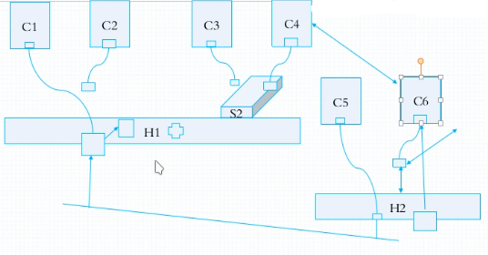

效率高，又不使用桥接的方法：**Overlay Network 叠加网络**

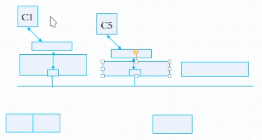

多个物理机上各有一个物理网卡。每个物理机上有一个虚拟机并且有一个桥，让各个容器或者虚拟机链接到虚拟桥上。随后，通信时借助于物理网络完成报文的隧道转发，从而可以实现，C1可以直接可以看到C1。实现方式是，物理主机彼此之间可以通信。而C1通信时，C1是的网络与物理网络不在同一地址段内，但是C1跟C5是同一地址段内。比如C1是192.168.1.1, C65192.168.1.5。C1发给C5的报文不在本机之上网络内。是在另外一个物理服务器之上的。C1先送给桥，这个桥会看到C5不在本地物理服务器上，于是这个报文会物理网卡发出去。但是发出去之前这么发的。他要做**隧道转发**。就是C1的IP报文源地址是C1，目标地址是C5。额外再封装IP首部，源地址是C1所在的物理机(H1)的网卡的地址，目标地址是C5所在的物理机(H1)的网卡地址。H2收到报文后，拆解第一层IP报文，开始第二层IP报文。第二层报文目标IP地址C5,所以直接交给本地的软交换机，由软网桥交给C5。用一个IP封装另外一个IP叫做隧道。C1和C6可以统一网段内通信。C1客户端请求C5服务。这样网络叫做叠加网络。

## Docker 网络

docker安装完之后，自动提供了3中网络

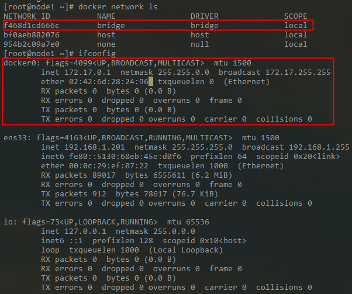

bridge 桥接式网络，是net桥（不是物理网络）,说明他在本机之上创建了软交换机 docker0，可以当**交换机或网卡**使用。不给地址只能以交换机来使用，给地址可以当网卡使用。每一次启动容器自动分配一对儿网卡地址（一个在容器上，另一个在软交换机上）。

``` sh
# yum -y instal bridge-utils
# brctl show
# ip link show
# iptables -t net -vnL

Chain PREROUTING (policy ACCEPT 1306 packets, 220K bytes)
 pkts bytes target     prot opt in     out     source               destination
   32  2230 DOCKER     all  --  *      *       0.0.0.0/0            0.0.0.0/0            ADDRTYPE match dst-type LOCAL

Chain INPUT (policy ACCEPT 1306 packets, 220K bytes)
 pkts bytes target     prot opt in     out     source               destination

Chain OUTPUT (policy ACCEPT 273 packets, 20069 bytes)
 pkts bytes target     prot opt in     out     source               destination
    0     0 DOCKER     all  --  *      *       0.0.0.0/0           !127.0.0.0/8          ADDRTYPE match dst-type LOCAL

Chain POSTROUTING (policy ACCEPT 273 packets, 20069 bytes)
 pkts bytes target     prot opt in     out     source               destination
    0     0 MASQUERADE  all  --  *      !docker0  172.17.0.0/16        0.0.0.0/0

Chain DOCKER (2 references)
 pkts bytes target     prot opt in     out     source               destination
    1    84 RETURN     all  --  docker0 *       0.0.0.0/0            0.0.0.0/0

# docker exec -it web1 /bin/sh
# docker network ls
NETWORK ID          NAME                DRIVER              SCOPE
b411f731fae4        bridge              bridge              local
bf0aeb882076        host                host                local
954b2c09a7e0        none                null                local

bridge: 容器使用桥接试网络(net网络，宿主机的虚拟网卡)
host: 让容器使用宿主机的网络名称空间
none: 容器没有网络，只有IO接口，不能网络通信
```

### Four network container archetypes

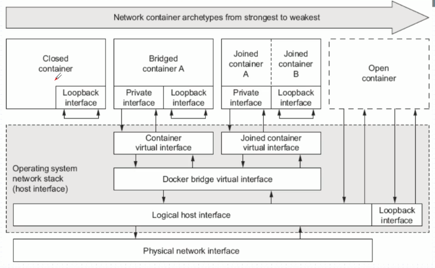

- none
  - 不设置虚拟网卡设备，只有lo接口
- bridge
  - 创建一对儿蓄念网卡设备，一半在网络名称空间，另一半儿在宿主机的Docker桥接上。
- 联盟式网络
  - 两个容器有一部分是隔离的，文件系统/用户/pid各个容器里，但是UTS/NET/IPC共享同一组，两个容器使用同一个网络设备，同一个网卡和同一个lo设备，共享设备在容器里。
  - 容器A和容器B共享网络名称空间，容器A和容器B可以本地通信lo。
- 开放式容器
  - 共享物理机的名称空间
  - 共享设备在宿主机的名称空间

``` sh
# docker container run --help
  --network string                 Connect a container to a network (default "default")
# docker netowkr ls
  bridge 是 default网络

# docker network insepct bridge
  "Subnet": "172.17.0.0/16"
  "Gateway": "172.17.0.1"
  "com.docker.network.bridge.name": "docker0"

# docker inspect web1
  "Gateway": "172.17.0.1",
  "IPAddress": "172.17.0.3"
```

## Docker 容器网络

``` sh
# rpm -q iproute

添加网络名称空间
# ip netns help
# ip netns add r1 默认只有lo设备
# ip netns add r2
# ip netns list

在r1网络名称空间中执行命令
# ip netns exec r1 ifconfig
# ip netns exec r1 ifconfig -a

创建虚拟网卡对儿
# ip link help
# ip link add veth1.1 type veth peer name veth1.2
# ip link sh
# ifconfig

veth1.1留在宿主机上，veth1.2挪到网络名称空间r1中
# ip link help
# ip link set veth1.2 netns r1
# ip link show

查看r1名称空间中是否有虚拟网卡设备
# ip netns exec r1 ifconfig -a

r1名称空间中的虚拟网卡其别名eth0
# ip netns exec r1 ip link set dev veth1.2 name eth0

激活虚拟网卡设备
# ifconfig veth1.1 10.1.0.1/24 up
# ip netns exec r1 ifconfig eth0 10.1.0.2/24 up
# ip netns exec r1 ifconfig

检测网络设备是否可以通信
# ping 10.1.0.2

# ip link set dev veth1.1 netns r2
# ifconfig
# ip netns exec r2 ifconfig
# ip netns exec r2 ifconfig -a
# ip netns exec r2 ifconfig vnet1.1 10.1.0.3/24 up
# ip netns exec r2 ifconfig

# ip netns exec r2 ping 10.1.0.2
```

### 桥接式容器-一对儿虚拟网卡设备

> 对外通信

``` sh
关闭自动删除
# docker run --name t1 -it --rm
/ # ifconfig
# exit

退出之后容器自动删除
# docker ps -a

手动指定bridge
# docker run --name t1 -it --network bridge --rm busybox:latest
/ # ifconfig
eth0      Link encap:Ethernet  HWaddr 02:42:AC:11:00:04  
          inet addr:172.17.0.4  Bcast:172.17.255.255  Mask:255.255.0.0
          UP BROADCAST RUNNING MULTICAST  MTU:1500  Metric:1
          RX packets:6 errors:0 dropped:0 overruns:0 frame:0
          TX packets:0 errors:0 dropped:0 overruns:0 carrier:0
          collisions:0 txqueuelen:0 
          RX bytes:508 (508.0 B)  TX bytes:0 (0.0 B)

lo        Link encap:Local Loopback  
          inet addr:127.0.0.1  Mask:255.0.0.0
          UP LOOPBACK RUNNING  MTU:65536  Metric:1
          RX packets:0 errors:0 dropped:0 overruns:0 frame:0
          TX packets:0 errors:0 dropped:0 overruns:0 carrier:0
          collisions:0 txqueuelen:1000 
          RX bytes:0 (0.0 B)  TX bytes:0 (0.0 B)
# eixt


手动指定bridge
# docker run --name t1 -it --network bridge --rm busybox:latest
/ # ifconfig

容器的ID-主机名
/ # hostname

设置正常主机名
# docker run --help
# docker run --name t1 -it --network bridge -h t1.wovert.com --rm busybox:latest

/ # hostname
t1.wovert.com

/ # cat /etc/hosts
127.0.0.1	localhost
::1	localhost ip6-localhost ip6-loopback
fe00::0	ip6-localnet
ff00::0	ip6-mcastprefix
ff02::1	ip6-allnodes
ff02::2	ip6-allrouters
172.17.0.4	t1.wovert.com t1

/ # cat /etc/resolv.conf
nameserver 114.114.114.114
nameserver 8.8.8.8

/ # nslookup -type=A www.qq.com


使用hosts文件解析DNS
# docker run --help
# docker run --name t1 -it --network bridge -h t1.wovert.com --dns 114.114.114.114 --dns-search ilinux.io  --rm busybox:latest
/ # cat /etc/resolv.conf
nameserver 114.114.114.114

# docker run --name t1 -it --network bridge -h t1.wovert.com --dns 114.114.114.114 --dns-search ilinux.io --add-host www.wovert.com:1.1.1.1  --rm busybox:latest
/ # cat/etc/hosts
127.0.0.1	localhost
::1	localhost ip6-localhost ip6-loopback
fe00::0	ip6-localnet
ff00::0	ip6-mcastprefix
ff02::1	ip6-allnodes
ff02::2	ip6-allrouters
1.1.1.1	www.wovert.com
172.17.0.4	t1.wovert.com t1
```

#### Openning inbound communication 桥接式容器到宿主机外部通信

- docker0：桥设备
  - 172.17.0.1

``` sh
暴露80端口
# docker run --name myweb --rm -p 80 wovert/httpd:v0.2
# docker inspect myweb
  "IPAddress": "172.17.0.2" 用于内部通信
# curl 172.17.0.2
  <h1>Busybox httpd server.</h1>

与外部通信使用宿主机地址(DNET)
# ifconfig
  ens33: inet 192.168.1.201  netmask 255.255.255.0  broadcast 192.168.1.255

80端口映射为？端口
# iptables -t nat -vnL
Chain DOCKER (2 references)
 pkts bytes target     prot opt in     out     source               destination
    1    84 RETURN     all  --  docker0 *       0.0.0.0/0            0.0.0.0/0
    0     0 DNAT       tcp  --  !docker0 *       0.0.0.0/0            0.0.0.0/0            tcp dpt:32768 to:172.17.0.2:80

外部容器服务，宿主机的32768端口映射为容器的80端口

# curl 192.168.1.201:32768

-p 80 添加选项之后自动添加iptables。容器删除自动也会删除iptables端口映射
# docker kill myweb
# iptables -t nat -vnL
[root@node1 ~]# iptables -t nat -vnL
Chain PREROUTING (policy ACCEPT 1 packets, 328 bytes)
 pkts bytes target     prot opt in     out     source               destinationa         
  184 13634 DOCKER     all  --  *      *       0.0.0.0/0            0.0.0.0/0            ADDRTYPE match dst-type LOCAL

Chain INPUT (policy ACCEPT 1 packets, 328 bytes)
 pkts bytes target     prot opt in     out     source               destination         

Chain OUTPUT (policy ACCEPT 0 packets, 0 bytes)
 pkts bytes target     prot opt in     out     source               destination         
    0     0 DOCKER     all  --  *      *       0.0.0.0/0           !127.0.0.0/8          ADDRTYPE match dst-type LOCAL

Chain POSTROUTING (policy ACCEPT 0 packets, 0 bytes)
 pkts bytes target     prot opt in     out     source               destination         
    1    56 MASQUERADE  all  --  *      !docker0  172.17.0.0/16        0.0.0.0/0           

Chain DOCKER (2 references)
 pkts bytes target     prot opt in     out     source               destination         
    1    84 RETURN     all  --  docker0 *       0.0.0.0/0            0.0.0.0/0 

查看映射主机
# docker port myweb
  80/tcp -> 0.0.0.0:32768
宿主机任意接口(0.0.0.0)的端口32769映射到容器端口80/tcp
```

浏览器访问


**指定宿主机接口**

``` sh
192.168.1.201::80 宿主机的192.168.1.201网卡的随机端口映射到容器端口80
# docker run --name myweb --rm -p 192.168.1.201::80 wovert/httpd:v0.2
# docker port myweb
  80/tcp -> 192.168.1.201:32768
# docker kill myweb
# docker run --name myweb --rm -p 192.168.1.201:80:80 wovert/httpd:v0.2
# docker port myweb
  80/tcp -> 192.168.1.201:80

# curl 192.168.1.201

-p 选项使用格式
-p <containerPort>
  将指定的容器端口<containerPort>应设置宿主机所有地址的一个动态端口
-p <hostPort>:<containerPort>
  将容器端口<containerPort>应映射至指定的宿主机端口<hostPort>
-p <ip>::<containerPort>
  将指定的容器端口<containerPort>映射至宿主机指定地址<ip>的一个动态端口
-p <p>:<hostPort>:<containerPort>
  将指定的容器端口<containerPort>映射至宿主机<hostPort>指定地址的端口<hostPort>

-P, --publish-all 向Nginx镜像使用默认使用80端口，但是，禁止暴露端口。-P选项之后暴露默认的端口80
将容器的所有计划要暴露端口全部映射至宿主机端口

计划要暴露的端口使用 --expose选项指定
例如：

# docker run -d -P --expose 2222 --expose 3333 --name web busybox:latest /bin/httpd -p 2222 -f
# docker port web

如果不想使用默认的docker0桥接口，或者需要修改此桥接的网络属性，可通过 `docker daemon`命令使用 `-b, --bip, --fixed-cidr, --default-gateway, --dns以及--mtu`等选项进行设定

```

### 封闭式容器 - 不创建虚拟网卡设备，只有lo接口

``` sh
# docker run --name t1 -it --network none --rm busybox:latest
/ # ifconfig -a
lo        Link encap:Local Loopback  
          inet addr:127.0.0.1  Mask:255.0.0.0
          UP LOOPBACK RUNNING  MTU:65536  Metric:1
          RX packets:0 errors:0 dropped:0 overruns:0 frame:0
          TX packets:0 errors:0 dropped:0 overruns:0 carrier:0
          collisions:0 txqueuelen:1000 
          RX bytes:0 (0.0 B)  TX bytes:0 (0.0 B)

```

### joined containers 联盟式容器

> 使用某个已存在的容器的网络接口的容器，接口被联盟内的各种容器共享使用；联盟式容器彼此间完全无隔离

```sh
创建一个监听2222端口的http服务容器
# docker run -d -it --rm -p 2222 busybox:latest /bin/httpd -p 2222 -f

创建一个联盟式容器，并查看其监听的端口
# docker run -it --rm --net container:web --name joined busybox:latest nestat -tan
```

联盟式容器彼此之间虽然共享一个网络名称空间，但其他名称空间如 User, Mount等还是隔离的

联盟式容器彼此之间存在端口冲突的可能性，因此，通常只会在多个容器上的程序需要程序loopback接口互相通信、或对某已存的容器的网络属性进行监控时才使用此种模式的网络模型。

``` sh
# docker run --name b1 -it --rm busybox
# docker run --name b2 -it --rm busybox

两个容器彼此彼此之间隔离，使用不同的IP地址172.17.0.2和172.17.0.3

退出b2并重新创建已b1容器作为网络名称空间
# exit
# docker run --name b2 -it --network container:b1 --rm busybox
(b2) / # ifconfig
inet addr:172.17.0.2  Bcast:172.17.255.255  Mask:255.255.0.0

(b1) / # ifconfig
inet addr:172.17.0.2  Bcast:172.17.255.255  Mask:255.255.0.0


两个容器文件系统是隔离的

(b1) / # mkdir /tmp/testdir

找不到目录
(b2) / # ls -l /tmp


(b2) / # echo "hello world" > /tmp/index.html
(b2) / # httpd -h /tmp/
(b2) / # netstat -tnl

(b1) / # wget -O - -q 127.0.0.1
hello world
```

### host containers 宿主机容器

``` sh
# docker run --name b2 -it --network host --rm busybox
(b2) / # ifconfig
docker0   Link encap:Ethernet  HWaddr 02:42:6D:28:24:96  
          inet addr:172.17.0.1  Bcast:172.17.255.255  Mask:255.255.0.0

ens33     Link encap:Ethernet  HWaddr 00:0C:29:EF:07:22  
          inet addr:192.168.1.201  Bcast:192.168.1.255  Mask:255.255.255.0

(b2) / # echo "hello container" > /tmp/index.html
(b2) / # httpd -h /tmp/
(b2) / # netstat -tnl

外部访问：192.168.1.201

与宿主机安装有什么区别？宿主机需要安装nginx等服务，但是容器只需要docker run

```

### 修改 docker0 默认网络地址

- 自定义docker0桥的网络属性信息：`/etc/docker/daemon.json`文件

``` json
{
  "bip": "172.16.0.5/24",             docker0桥的IP地址和掩码
  "fixed-cidr": "10.20.0.0/16",
  "fixed-cidr-v6": "2001:db8::/64",
  "mtu": 1500,
  "default-gateway": "10.20.1.1",     默认网关
  "default-gateway-v5": "2001:db8:abcd::89",
  "dns": ["10.20.1.2", "10.20.1.3"]   dns服务器地址，至少1个，至多3个
}
```

```sh
# systemctl stop docker
# vim /etc/docker/daemon.json
# systemctl start doker
# ifconfig
inet 10.0.0.1  netmask 255.255.0.0  broadcast 10.0.255.255

```

- dockerd守护进程的C/S，其默认进监听**Unix Socket**格式的地址，`/var/run/docker.sock`；如果使用TCP套接字家庭，那么设置，`/etc/docker/daemon.json`: `"host": ["tcp://0.0.0.0:2375", "unix:///var/run/docker.sock"]`

``` sh
# systemctl stop docker
# vim /usr/lib/systemd/system/docker.service
  ExecStart=/usr/bin/dockerd -H tcp://0.0.0.0:2375 -H unix:///var/run/docker.sock


另一个docker客户端连接
# docker -H tcp://192.168.1.201:2375 ps
# docker -H tcp://192.168.1.201:2375 image ls

```

### 创建自定义桥

```sh
# docker info
  Network: bridge host macvlan null overlay
# docker network --help

mybr0网络名
# docker network create -d dridge --subnet "172.26.0.0/16" --gateway "172.26.0.1" mybr0

# docker network ls
  NETWORK ID          NAME                DRIVER              SCOPE
  aed1a92997c9        bridge              bridge              local
  df8bd38aa079        host                host                local
  2ea8c613a8fd        mybr0               bridge              local
  a5c706058e19        none                null                local

# ifconfig
  br-2ea8c613a8fd: flags=4099<UP,BROADCAST,MULTICAST>  mtu 1500
          inet 172.26.0.1  netmask 255.255.0.0  broadcast 172.26.255.255

  docker0: flags=4099<UP,BROADCAST,MULTICAST>  mtu 1500
          inet 10.0.0.1  netmask 255.255.0.0  broadcast 10.0.255.255
          ether 02:42:34:ae:77:94  txqueuelen 0  (Ethernet)

  ens33: flags=4163<UP,BROADCAST,RUNNING,MULTICAST>  mtu 1500
          inet 192.168.1.201  netmask 255.255.255.0  broadcast 192.168.1.255

  lo: flags=73<UP,LOOPBACK,RUNNING>  mtu 65536
          inet 127.0.0.1  netmask 255.0.0.0

修改接口名
# ifconfig br-2ea8c613a8fd down
# ip link set dev br-2ea8c613a8fd name docker1
# ifconfig docker1 up
# ifconfig
  ...
  docker1: flags=4099<UP,BROADCAST,MULTICAST>  mtu 1500
          inet 172.26.0.1  netmask 255.255.0.0  broadcast 172.26.255.255
  ...

# docker run --name t1 -it --net mybr0 busybox
/ # ifconfig
  eth0      Link encap:Ethernet  HWaddr 02:42:AC:1A:00:02  
            inet addr:172.26.0.2  Bcast:172.26.255.255  Mask:255.255.0.0

默认桥
# docker run --name t2 -it --net bridge busybox
/ # ifconfig
eth0      Link encap:Ethernet  HWaddr 02:42:0A:00:00:02  
          inet addr:10.0.0.2  Bcast:10.0.255.255  Mask:255.255.0.0

宿主机打开核心转发
# cat /proc/sys/net/ipv4/ip_forward
1

不同通信，因为自动在iptables阻断(阻断打开才能通信)
(10.0.0.2) / # ping 172.26.0.2

```

## docker 存储卷

- Docker镜像由多个只读层叠加而成，启动容器时，Docker会加载只读镜像层并在镜像栈顶部添加一个读写层
- 如果运行中的容器修改了现有的一个已经存在的文件，那该文件将会从读写层下面的只读层复制到读写层，该文件的只读版本仍然存在，只是已经被读写层中该文件的副本所隐藏，此即“写时复制（COW）”机制

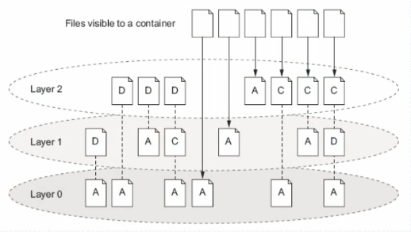

容器内部与宿主机文件绑定关系，相对于容器来讲被称之为volume(存储卷)。容器关闭时，数据持久化。

### Why Data Volume?

- 关闭并重启容器，其数据不受影响；但删除Docker容器，则其更改将会全部丢失
- 存在的问题
  - 存储于联合文件系统中，不易于宿主机访问
  - 容器间数据共享不便
  - 删除容器其数据会丢失

- 解决方案：卷（volume）
  - 卷是容器上的一个或多个目录，此类目录可绕过联合文件系统，与宿主机上某个目录绑定（关联）


### Data volumes

- Volume于容器初始化之时即会创建，由 base image提供的卷中的数据会于此期间完成复制
- Volume的初衷是独立于容器的声明周期实现数据持久化，因此删除容器之时即不会删除卷，不不会对哪怕未被引用的卷做垃圾回收操作

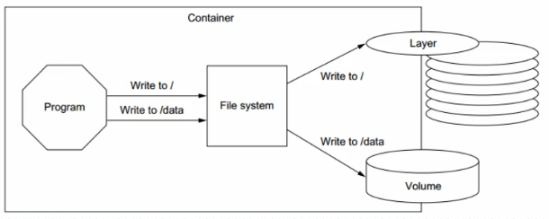

- 卷为docker提供了独立于容器的数据管理机制
  - 可以把“镜像“想象成静态文件，例如”程序“，把卷类比为动态内容，例如“数据”，于是，镜像可以重用，而卷可以共享
  - 卷实现了“程序（镜像）”和“数据（卷）”分离，以及“程序（镜像）”和“制作镜像的主机”分离，用户制作镜像时无需再考虑镜像运行的容器所在的主机的环境

### 卷类型

> 每种类型都在容器中存在一个挂载点，但其在宿主机上位置所不同

- Bind mount volume
  - a volume that points to a user-specified location on the host file system
- Docker-mangaed volume
  - the Docker daemon creates managed volumes in a portion of the host's file system that's owned by Docker

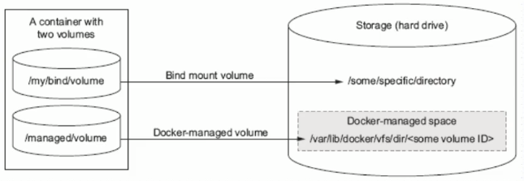

### 容器中使用 volume

Docker-managed volume

``` sh
# docker run -it -name b2 -v /data busybox
# docker inspect b2
 "Mounts": [
            {
                "Type": "volume",
                "Name": "93927b5b6b853467bc4c3a3603f0668f235e0336b0faa37d5ff49e71a71b6b04",
                "Source": "/var/lib/docker/volumes/93927b5b6b853467bc4c3a3603f0668f235e0336b0faa37d5ff49e71a71b6b04/_data",
                "Destination": "/data",
                "Driver": "local",
                "Mode": "",
                "RW": true,
                "Propagation": ""
            }
        ],

# cd /var/lib/docker/volumes/93927b5b6b853467bc4c3a3603f0668f235e0336b0faa37d5ff49e71a71b6b04/_data

# echo "hello world" > helloworld.html

/ # ls -l /data
  -rw-r--r--    1 root     root            12 Jan 18 11:21 helloworld.html
/ # cd /data
/ # echo "hello host" >> helloworld.html

```

Bind-mount Volume

绑定关系 `docker run -it -v HOSTDIR:VOLUMEDIR`

``` sh
# docker run --name b2 -it --rm -v /data/volumes/b2:/data busybox
# docker inspect -f {{.Mounts}} b2
# docker inspect -f {{.NetworkSettings.IPAddress}} b2
```

### Sharing volumes

- 多个容器的卷使用同一个主机目录，例如
  - `# docker run -it --name c1 -v /docker/volumes/v1:/data busybox`
  - `# docker run -it --name c2 -v /docker/volumes/v1:/data busybox`
- 复制使用其他容器的卷，为docker run 命令使用 --volumes-from选项
  - `# docker run -it --name bbox1 -v /docker/volumes/v1:/data busybox`
  - `# docker run -it --name bbox2 --volumes-from bbox1 busybox`

``` sh
基础容器
# docker run --name infracon -it -v /data/infracon/volumes/:/data/web/html busybox

复制卷
# docker run --name nginx --network container:infracon --volumes-from infracon -it busybox

# docker inspect infracon
# docker inspect nginx
```

## docker-compose

> 容器编排和容器镜像工具

## dockerfile

1. docker exec CONTAINVER vi, reload
2. 宿主机的设置配置文件，容器的应用程序默认加载宿主机设置好的配置文件
3. 资质镜像：基于容器做配置文件镜像；缺陷：写死在镜像中，变更时还是有问题

### 镜像相关操作

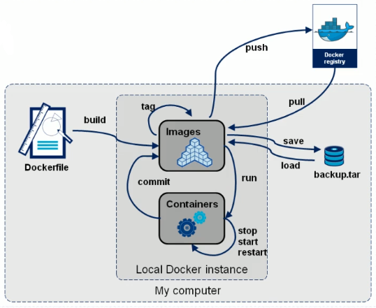

- 镜像的生成途径
  - 1. Dockerfile
  - 2. 基于容器制作

### About Dockerfile

> Dockerfile is nothing but hte source code for building Docker images

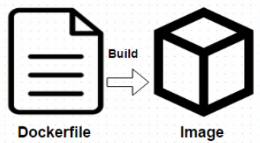

- Docker can build images automatically by reading the instructions from a Dockerfile
- A Dockerfile is a **text document** that contains all the commands a user could call on the command line to assemble an image
- Using docker build users can create an automated build that executes serveral command-line instruactions in succession

### Dockerfile Format

- Format
  - `# Comment` 注释
  - INSTRUCTION arguments 指令及其参数

- The instruction is not case-sensitive 指令不区分大小写
  - However, **convention** is for them to be **UPPERCASE** to distinguish them from arguments more easily
- Docker runs instructions in a Dockerfile in **order**
- The first instruction must be `FROM` in order to specify the Base Image from which you are building

### Dockerfile 工作逻辑

1. 统一所有资源文件及目录在指定的目录放置
2. 其目录下创建的 .dockerignore 文件中编辑的文件及目录都不会打包
3. docker build

### Enviroment replacement

``` sh
${variable:-word} 变量为空，使用word字符串
${variable:+word} 变量为值，使用word字符串
```

### Dockerfile Instructions

- `FROM`
  - FROM指令是最重要的一个且必须为Dockerfile文件开篇的第一个非注释行，用于为映像文件构建过程指定基准镜像，后续的指令云星宇此基准镜像所提供的运行镜像
  - 实践中，基准镜像可以是任何可用镜像文件，默认情况下，docker build会在docker主机上查找指定的镜像文件，在其不存在时，则会从Docker Hub REgistry 上拉去所需的镜像文件
    - 如果找不到指定的镜像文件，docker build 会返回一个错误信息

  - Syntax
    - `FROM <repository>[:<tag>]`或
    - `FROM <repository>@<digest>`
      - `<repository>`: 指定作为 base image的名称
      - `<tag>`: base image 的标签，为可选项，省略时默认为 latest

- `MAINTANIER`(depreacted)
  - 用于让Dockerfile制作者提供本人的详细信息
  - Dockerfile并不限制MAINTAINER指令可在出现的位置，但推荐将其放置于FROM指令之后
  - Syntax
    - `MAINTAINER <authtor's detail>`
      - `<author's detail>` 可是任何文本信息，但约定俗称地使用作者名称及邮件地址
      - `MAINTAINER "wovert <wovert@126.com>"`

- `LABEL`
  - The LABEL instruction adds metadata to an image
    - Syntax: `LABEL <key>=<value> <key>=<value> <key>=<value> ...`
    - The LABEL instruction adds metaadd to an image
    - A LABEL is key-value pair
    - To include spaces within a LABEL value, use quotes and backslashes as you would in command-line parsing
    - An image can have more that one label
    - You can specify multiple labels on a single line

- `COPY`
  - 用于从Docker主机复制文件至创建的新映像文件
  - Syntax
    - `COPY <src> ... <dest>` 或
    - `COPY ["<sc>",... "<dest>"]`
      - `<src>`: 要复制的源文件或目录，支持使用通配符
      - `<dest>`: 目标路径，即正在创建的 image 的**文件系统路径**；建议为`<dest>`使用绝对路径，否则，COPY指定则以`WORKDIR`为其起始路径
      - 注意：在路径中有**空白字符**时，通常使用第二种格式
  - 文件复制准则
    - `<src>` 必须是build上下文中的路径，不能是其父目录中的文件
    - 如果`<src>` 是目录，则其内部文件或子目录会被递归复制，但`<src>`目录自身不会被复制
    - 如果指定了多个`<src>`，或在`<src>`中使用了通配符，则`<dest>`必须是一个目录，且必须以`/`结尾
    - 如果`<dest>`事先不存在，它将会被自动创建，这包括其父目录路径

- `ADD`
  - `ADD`指令类似于COPY指令，ADD支持使用TAR文件和URL路径
  - Syntax
    - `ADDD <src> ... <dest>` 或
    - `ADD ["<src>", ... "<dest>"]`
  - 操作准则
    - 同COPY指令
    - 如果<src>为URL且<dest>不以/结尾，则<src>指令的文件将被下载并直接被创建为<dest>；如果<dest>以/结尾，则文件名URL指令的文件将被直接下载并保存为<dest>/<filename>
    - 如果<src>是一个本地系统上的压缩格式的tar文件，它将被展开为一个目录，其行为类似于`tar -x`命令； 然而，通过URL获取到的tar文件将不会自动展开
    - 如果<src>不以/结尾，则其被视作一个普通文件，<src>的内容将被直接写入到<dest>;

- `WORKDIR`

- `VOLUME`
  - 用于在image中创建一个挂载点目录，以挂载Docker host上的卷或其他容器上的卷
  - Syntax
    - `VOLUME <mountpoint>` 或
    - `VOLUME ["<mountpoint>"]`
  - 如果挂载点目录路径下此前在文件存在，docker run 命令会在卷挂载完成后将此前的所有文件复制到新挂载的卷中

- `EXPOSE`
  - 用于为容器打开指定要监听的端口以实现与外部通信 (暴露容器的端口与宿主机的随机端口)
  - Syntax
    - `EXPOSE <port>[/<protocol>][<port>[/<protocol>] ...]`
      - `<protocol>`用于指定传输层协议，可以为tcp或udp二者之一，默认为TCP协议
  - EXPOSE 指令可一次指定多个端口，例如
    - `EXPOSE 11211/udp 11211/tcp`

### 制作镜像过程

``` sh
# mkdir img1
# cd img1
# cp -r /etc/yum.reposd/ ./
# vim Dockerfile
  # Description: test image
  FROM busybox:latest
  #MAINTAINER "wovert <wovert@126.com>"
  LABEL maintainer="wovert <wovet@126.com>"
  COPY index.html /data/web/html/
  COPY yum.repos.d /etc/yum.repos.d/
  ADD http://nginx.org/download/nginx-1.15.2.tar.gz /usr/local/src/
# docker build -t tinyhttpd:v0.1-2 ./
# docker image
# docker run --name tinyweb1 --rm tinyhttpd:v0.1-1 ls /etc/yum.repos.d/
# docker run --name tinyweb1 --rm tinyhttpd:v0.1-1 ls /usr/local/src/

# wget http://nginx.org/download/nginx-1.15.2.tar.gz
# vim Dockerfile
  FROM busybox:latest
  #MAINTAINER "wovert <wovert@126.com>"
  LABEL maintainer="wovert <wovet@126.com>"
  COPY index.html /data/web/html/
  COPY yum.repos.d /etc/yum.repos.d/
  WORKDIR /usr/local/src/
  ADD nginx-1.15.2.tar.gz ./
# docker build -t tinyhttpd:v0.1-4 ./
# docker run --name tinyweb1 --rm tinyhttpd:v0.1-4 ls /usr/local/src/nginx-1.15.2


挂载点宿主机
# vim Dockerfile
  FROM busybox:latest
  #MAINTAINER "wovert <wovert@126.com>"
  LABEL maintainer="wovert <wovet@126.com>"
  COPY index.html /data/web/html/
  COPY yum.repos.d /etc/yum.repos.d/
  WORKDIR /usr/local/src/
  ADD nginx-1.15.2.tar.gz ./
  VOLUME /data/mysql
# docker build -t tinyhttpd:v0.1-5 ./
# docker run --name tinyweb1 --rm tinyhttpd:v0.1-5 mount
# docker run --name tinyweb1 --rm tinyhttpd:v0.1-5 sleep 60
# docker inspect tinyweb1

监听端口
# vim Dockerfile
  FROM busybox:latest
  #MAINTAINER "wovert <wovert@126.com>"
  LABEL maintainer="wovert <wovet@126.com>"
  COPY index.html /data/web/html/
  COPY yum.repos.d /etc/yum.repos.d/
  WORKDIR /usr/local/
  ADD nginx-1.15.2.tar.gz ./src/
  VOLUME /data/mysql/
  EXPOSE 80/tcp
# docker build -t tinyhttpd:v0.1-6 ./
# docker run --name tinyweb1 --rm tinyhttpd:v0.1-6 /bin/httpd -f -h /data/web/html
# docker inspect tinyweb1
# curl 10.0.0.2
# docker port tinyweb1

暴露端口: -P
# docker run --name tinyweb1 --rm -P tinyhttpd:v0.1-6 /bin/httpd -f -h /data/web/html
# docker port tinyweb1
  80/tcp -> 0.0.0.0:32768

浏览器访问：http://192.168.1.201:32768/
```

72:00