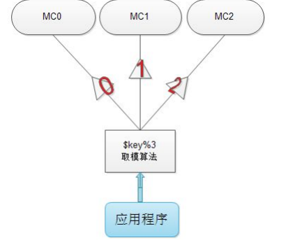
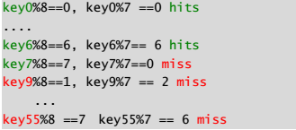
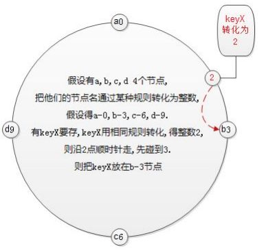
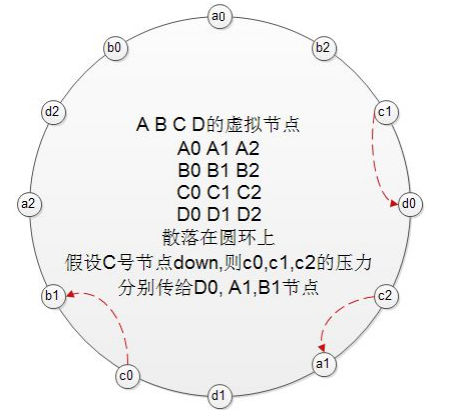

# memcached介绍

- 数据结构模型：
  - 结构化数据：关系型数据库
    - 多表文件IO，排序 => 缓存数据
  - 半结构化数据：xml,json，NoSQL(Redis,Hbase,MongoDB)
  - 非结构化数据：文件系统

- K/V
  - memcached: 存储于内存中
  - redis: 存储于内存中，周期性地将数据同步于辅存上

## memcached

> Livejournal旗下的Danga Interactive

- [livejournal](https://www.livejournal.com/)
- [danga](http://danga.com/)
- [memcached](http://memecached.org)

Free & open source, high-performance, distributed object caching system

有livejournal旗下的danga公司开发

## Memcached features

- k/v缓存：可序列化数据；（打散，流式化数据）存储箱：key,value,flag,expire time
- 功能的实现一半依赖于服务端，一半依赖客户端
- 分布式缓存(memcached协议)：互不通信的分布式集群
- O(1)的执行效率
- 清理过期数据: LRU
  - 缓存项过期
  - 缓存空间用尽

## Kinds of Cache System

- 代理式缓存
  - 请求 -> 代理服务器(未命中) -> 后台查找数据 -> 返回给代理服务器(缓存数据) -> 响应请求
- 旁路式缓存
  - 请求 -> 缓存服务器(有数据直接直接响应，没有则请求原始数据) -> 原始存储端请求数据
  - 客户端决定缓存：差哪个缓存，怎么缓存

## 分布式系统主机路由

- 取模法：key -> hash计算key -> 1
  - 缺点：增加节点之后，之前节点都缓存失效
- 一致性hash
  - 环形
  - 服务器IP hash计算 23^ 取模

### 分布式取模算法

> 取模算法：N个节点要从0->N-1编号，key对N取模，余i，则key落在第i台服务器上



取模算法对缓存命中率的影响

假设有8台服务器运行中，突然down一台，则求余的底数变为7，后果：



从数学的概念上来讲，有N台服务器，变为N-1台，每N(N-1)个数中，只有(n-1)个单元，所以，命中率在服务器down的短期内，急剧下降至(N-1)/(N(N-1)) = 1/(N-1),所以，服务器越多，则down机的后果越严重。

### 一致性哈希算法原理

通俗理解一致性哈希：把各服务器节点映射放在钟表的各个时刻上，把key也映射到钟表的某个时刻上，该key沿钟表顺时针走，碰到的第一个节点即为该key的存储节点，如下图：

问题1：时钟上的指针最大才11点，如果有上百个memcached节点怎么办？



时钟只是为了便于理解做的比喻，实际应用中，我们可以在圆环上分布[0,2^32-1]的数字，这样，全世界的服务器都可以装下了。
问题2：如何把“节点名”，“键名”转化成整数？
　　可以使用函数，如crc32()，也可以自己去设计转化规则，但注意转化后的碰撞率要低，即不同的节点名，转换为相同的整数的概率要低。

一致性哈希对其他节点的影响

通过下图可以看出，当某个节点down后，只影响该节点顺时针之后的1个节点，而其他节点不受影响。因此，Consistent Hashing最大限度地抑制了键的重新分布。


### 一致性哈希+虚拟节点对缓存命中率的影响

由上图可以看到，理想状态下，
1）节点在圆环上分配均匀，因此承担的任务也平均，但事实上，一般的hash函数对于节点在圆环上的映射，并不均匀
2）当某个节点down后，直接冲击下一个节点对下一个节点冲击过大，能否把down节点上的压力平均的分担到所有节点上

解决方案：引入虚拟节点来达到目的

虚拟节点即N个真实节点，把每个真实节点映射成M个虚拟节点，再把M*N个虚拟节点，散列在圆环上，各真实节点对应的虚拟节点相互交错分布，这样，某个真实节点down后，则把其影响平均分担到其他所有节点上。



## Setup Memcahed

``` sh
# yum info memcached
# yum -y install memcached
# rpm -ql memcahed
```

- 11211/tcp,11211/udp
- 主程序：memecached
- 环境配置文件：`/etc/sysconfig/memcached`
  - PORT="11211"
  - USER="memcached"
  - MAXCONN="1024"
  - CACHESIZE="64"
  - OPTIONS=""

`# systemcl start memcahced.servie`

## 协议格式

- 文本协议
- 二进制协议

## memcached客户端程序

- telnet
  - `# yum -y install telnet`
  - `# telnet 172.16.100.6 11211`
- 命令
  - 统计类：`stats, stat items, stats slabs, stats sizes`
    - stats
      - pid
      - uptime 运行多长时间 秒
      - time 当前系统时间戳
      - version 版本号
      - libevent 基于那个并发库
      - cmd_get get命令运行过多少次
      - get_hits get命中了多少次
  - 存储类：`set, add, replace, append, prepend`
  - 获取数据：`get keyname, delete keyname, incr/decr (加+)`
  - 清空：`flush_all`

```
add key flag expires length

mykey键名 flag 缓存有效时间(秒) 5个字节
set mykey 0  60 5
hello
stats items
get mykey

统计数据
stats

新增16字节
append mykey 0 300 16
get mykey

新增16字节
prepend mykey 0 300 16
get mykey

incr mykey 1
```

## memcached程序的常用选项

- -l <ip_addr>：监听的地址
- -u <username>：assume the identify of <username>
- -m <num>：缓存空间大小，单位为MB; 默认为64MB
- -c <num>：最大并发连接数，默认为1024
- -p <num>：TCP port, 11211
- -U <num>：UDP Port, 11211， -U 0关掉
- -M：缓存空间耗尽时，向请求者返回错误信息，而不是基于LRU算法进行缓存清理
- -f <factor>：growth factor，增长因子
  - `# memcached -u memcached -f 1.1 -vv`
- t <thread>：处理用于请求的线程数
- B <proto>：ascii or binary

- memcached 默认没有认证机制，但可借助于SASL进行认证

## slab：内存分配器

`stats slab`

## PHP连接memecached服务的模块

- memcache：php-perl-memcache
- memcached：php-perl-memcached PHP扩展

## 可提供工具程序的程序包

``` sh
memcache提供C接口
# yum -y install libmemcached
# memstat --help
# systemctl start memcached
# memstat --servers=127.0.0.1
```

##　LB Cluster保持会话地方法

- session stick
- session cluster
- session server

《LVS Web PHP session memcached.txt》

- 博客作业：nginx调度负载均衡用户请求至后端多个ammp主机，PHP的会话保存于memcached中


Memcached是一款开源、高性能、分布式内存对象缓存系统，可应用各种需要缓存的场景，其主要目的是通过降低对Database的访问来加速web应用程序。它是一个基于内存的“键值对”存储，用于存储数据库调用、API调用或页面引用结果的直接数据，如字符串、对象等。

memcached是以LiveJournal旗下Danga Interactive 公司的Brad Fitzpatric 为首开发的一款软件。现在
已成为mixi、hatena、Facebook、Vox、LiveJournal等众多服务中提高Web应用扩展性的重要因素。

Memcached是一款开发工具，它既不是一个代码加速器，也不是数据库中间件。其设计哲学思想主要反映在如下方面：

1. 简单key/value存储：服务器不关心数据本身的意义及结构，只要是可序列化数据即可。存储项由“键、过期时间、可选的标志及数据”四个部分组成；
2. 功能的实现一半依赖于客户端，一半基于服务器端：客户负责发送存储项至服务器端、从服务端获取数据以及无法连接至服务器时采用相应的动作；服务端负责接收、存储数据，并负责数据项的超时过期；
3. 各服务器间彼此无视：不在服务器间进行数据同步；
4. O(1)的执行效率
5. 清理超期数据：默认情况下，Memcached是一个LRU缓存，同时，它按事先预订的时长清理超期数据；但事实上，memcached不会删除任何已缓存数据，只是在其过期之后不再为客户所见；而且，memcached也不会真正按期限清理缓存，而仅是当get命令到达时检查其时长；

Memcached提供了为数不多的几个命令来完成与服务器端的交互，这些命令基于memcached的协议实现。

存储类命令：set, add, replace, append, prepend
获取数据类命令：get, delete, incr/decr
统计类命令：stats, stats items, stats slabs, stats sizes
清理命令： flush_all

一、安装libevent

memcached依赖于libevent API，因此要事先安装之，项目主页：http://libevent.org/，读者可自行选择需要的版本下载。本文采用的是目前最新版本的源码包libevent-2.0.21-stable.tar.gz。安装过程：

# tar xf libevent-2.0.21-stable.tar.gz
# cd libevent-2.0.21
# ./configure --prefix=/usr/local/libevent
# make && make install

# echo "/usr/local/libevent/lib" > /etc/ld.so.conf.d/libevent.conf
# ldconfig 

二、安装配置memcached

1、安装memcached
# tar xf memcached-1.4.15.tar.gz 
# cd memcached-1.4.15
# ./configure --prefix=/usr/local/memcached --with-libevent=/usr/local/libevent
# make && make install


2、memcached SysV的startup脚本代码如下所示，将其建立为/etc/init.d/memcached文件：

#!/bin/bash
#
# Init file for memcached
#
# chkconfig: - 86 14
# description: Distributed memory caching daemon
#
# processname: memcached
# config: /etc/sysconfig/memcached

. /etc/rc.d/init.d/functions

## Default variables
PORT="11211"
USER="nobody"
MAXCONN="1024"
CACHESIZE="64"
OPTIONS=""

RETVAL=0
prog="/usr/local/memcached/bin/memcached"
desc="Distributed memory caching"
lockfile="/var/lock/subsys/memcached"

start() {
        echo -n $"Starting $desc (memcached): "
        daemon $prog -d -p $PORT -u $USER -c $MAXCONN -m $CACHESIZE -o "$OPTIONS"
        RETVAL=$?
        [ $RETVAL -eq 0 ] && success && touch $lockfile || failure
        echo
        return $RETVAL
}

stop() {
        echo -n $"Shutting down $desc (memcached): "
        killproc $prog
        RETVAL=$?
        [ $RETVAL -eq 0 ] && success && rm -f $lockfile || failure
        echo
        return $RETVAL
}

restart() {
        stop
        start
}

reload() {
        echo -n $"Reloading $desc ($prog): "
        killproc $prog -HUP
        RETVAL=$?
        [ $RETVAL -eq 0 ] && success || failure
        echo
        return $RETVAL
}

case "$1" in
  start)
        start
        ;;
  stop)
        stop
        ;;
  restart)
        restart
        ;;
  condrestart)
        [ -e $lockfile ] && restart
        RETVAL=$?
        ;;       
  reload)
        reload
        ;;
  status)
        status $prog
        RETVAL=$?
        ;;
   *)
        echo $"Usage: $0 {start|stop|restart|condrestart|status}"
        RETVAL=1
esac

exit $RETVAL


使用如下命令配置memcached成为系统服务：
# chmod +x /etc/init.d/memcached
# chkconfig --add memcached
# service memcached start

3、使用telnet命令测试memcached的使用

Memcached提供一组基本命令用于基于命令行调用其服务或查看服务器状态等。

# telnet 127.0.0.1 11211


add命令：
add keyname flag  timeout  datasize
如：
add mykey 0 10 12
Hello world!

get命令：
get keyname
如：get mykey
VALUE mykey 0 12
Hello world!
END

4、memcached的常用选项说明

-l <ip_addr>：指定进程监听的地址；
-d: 以服务模式运行；
-u <username>：以指定的用户身份运行memcached进程；
-m <num>：用于缓存数据的最大内存空间，单位为MB，默认为64MB；
-c <num>：最大支持的并发连接数，默认为1024；
-p <num>: 指定监听的TCP端口，默认为11211；
-U <num>：指定监听的UDP端口，默认为11211，0表示关闭UDP端口；
-t <threads>：用于处理入站请求的最大线程数，仅在memcached编译时开启了支持线程才有效；
-f <num>：设定Slab Allocator定义预先分配内存空间大小固定的块时使用的增长因子；
-M：当内存空间不够使用时返回错误信息，而不是按LRU算法利用空间；
-n: 指定最小的slab chunk大小；单位是字节；
-S: 启用sasl进行用户认证；


三、安装Memcached的PHP扩展

①安装PHP的memcache扩展

# tar xf memcache-2.2.5.tgz
# cd memcache-2.2.5
/usr/local/php/bin/phpize
# ./configure --with-php-config=/usr/local/php/bin/php-config --enable-memcache
# make && make install

上述安装完后会有类似以下的提示：

Installing shared extensions:     /usr/local/php/lib/php/extensions/no-debug-non-zts-20090626/

②编辑/usr/local/php/lib/php.ini，在“动态模块”相关的位置添加如下一行来载入memcache扩展：
extension=/usr/local/php/lib/php/extensions/no-debug-non-zts-20090626/memcache.so


而后对memcached功能进行测试，在网站目录中建立测试页面test.php，添加如下内容：
<?php
    $mem = new Memcache;
    $mem->connect("127.0.0.1", 11211)  or die("Could not connect");

    $version = $mem->getVersion();
    echo "Server's version: ".$version."<br/>\n";

    $mem->set('hellokey', 'Hello World', 0, 600) or die("Failed to save data at the memcached server");
    echo "Store data in the cache (data will expire in 600 seconds)<br/>\n";

    $get_result = $mem->get('hellokey');
    echo "$get_result is from memcached server.";         
?>


如果有输出“Hello World is from memcached.”等信息，则表明memcache已经能够正常工作。


四、使用libmemcached的客户端工具:

访问memcached的传统方法是使用基于perl语言开发的Cache::memcached模块，这个模块在大多数perl代码中都能良好的工作，但也有着众所周知的性能方面的问题。libMemcached则是基于C语言开发的开源的C/C++代码访问memcached的库文件，同时，它还提供了数个可以远程使用的memcached管理工具，如memcat, memping，memstat，memslap等。

1) 编译安装libmemcached

# tar xf libmemcached-1.0.2.tar.gz 
# cd libmemcached-1.0.2
# ./configure 
# make && make install
# ldconfig

2) 客户端工具
# memcat --servers=127.0.0.1:11211 mykey
# memping 
# memslap
# memstat


五、Nginx整合memcached:

server {
        listen       80;
        server_name  www.magedu.com;

        #charset koi8-r;

        #access_log  logs/host.access.log  main;

        location / {
                set $memcached_key $uri;
                memcached_pass     127.0.0.1:11211;
                default_type       text/html;
                error_page         404 @fallback;
        }

        location @fallback {
                proxy_pass http://172.16.0.1;
        }
}


### PHP+Memcached

#### 前提

1. 配置各php支持使用memcache；
2. 安装配置好memcached服务器，这里假设其地址为172.16.200.11，端口为11211；

#### 1. 配置php将会话保存至memcached中

编辑php.ini文件，确保如下两个参数的值分别如下所示：
session.save_handler = memcache
session.save_path = "tcp://172.16.200.11:11211?persistent=1&weight=1&timeout=1&retry_interval=15"

#### 2.测试

新建php页面setsess.php，为客户端设置启用session：

```php
<?php
session_start();
if (!isset($_SESSION['www.MageEdu.com'])) {
  $_SESSION['www.MageEdu.com'] = time();
}
print $_SESSION['www.MageEdu.com'];
print "<br><br>";
print "Session ID: " . session_id();
?>

新建php页面showsess.php，获取当前用户的会话ID：
<?php
session_start();
$memcache_obj = new Memcache;
$memcache_obj->connect('172.16.200.11', 11211);
$mysess=session_id();
var_dump($memcache_obj->get($mysess));
$memcache_obj->close();
?>
<?php 
// Generating cookies must take place before any HTML. 
// Check for existing "SessionId" cookie 
$session = $HTTP_COOKIE_VARS["SessionId"]; 
if ( $session == "" ) { 
// Generate time-based unique id. 
// Use user's IP address to make more unique. 
$session = uniqid ( getenv ( "REMOTE_ADDR" ) ); 
// Send session id - expires when browser exits 
SetCookie ( "SessionId", $session ); 
}
?>
```

``` html
<HTML> 
<HEAD><TITLE>Session Test</TITLE></HEAD> 
<BODY> <br> 16 Current session id: <?php echo $session ?> 
</BODY></HTML>
```