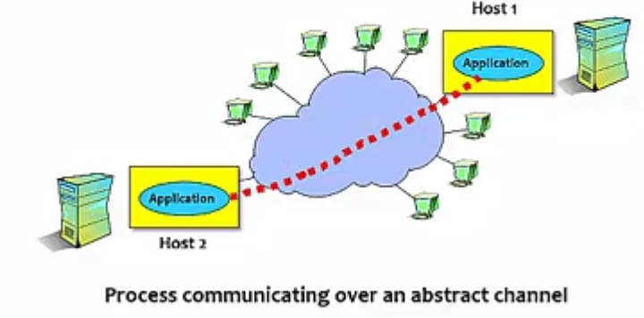
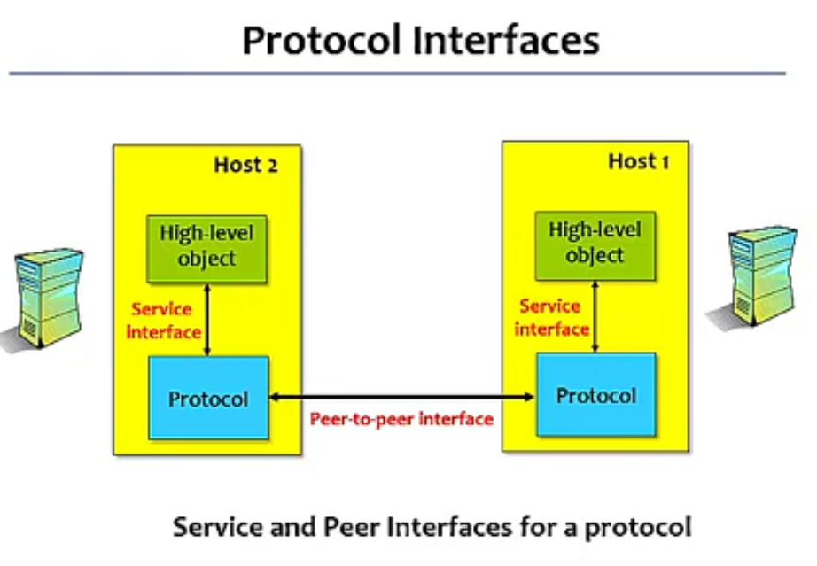
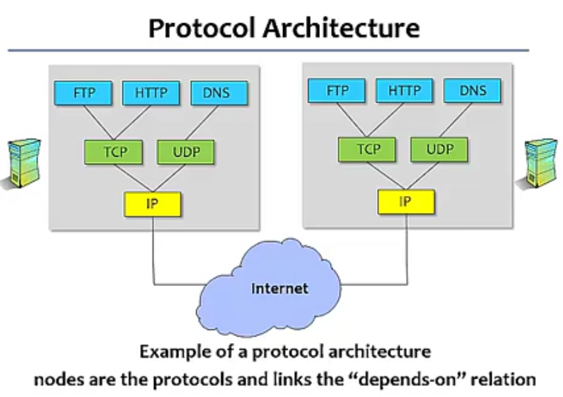
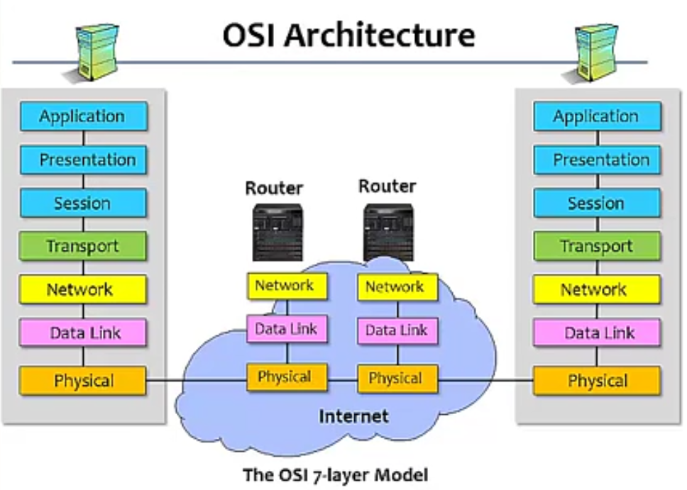
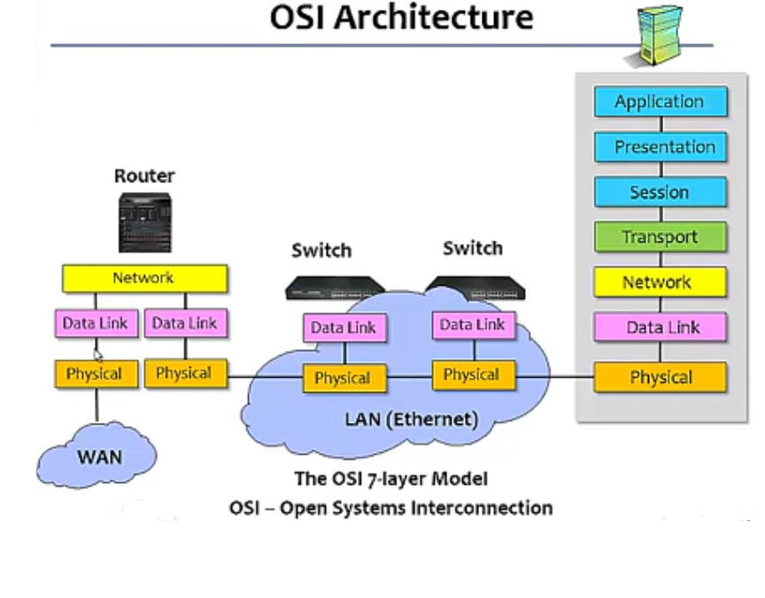
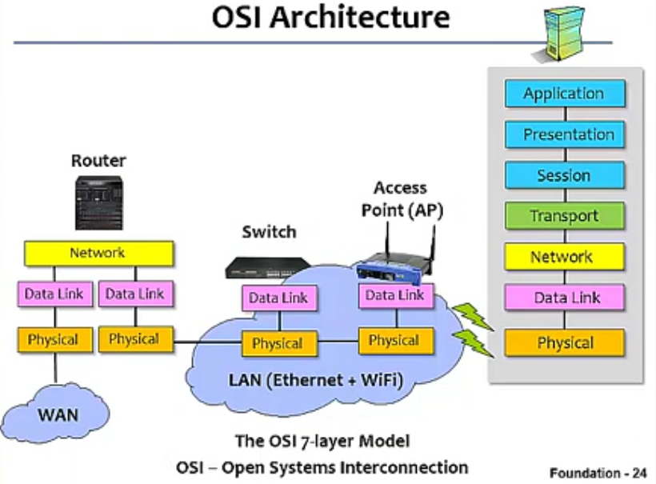
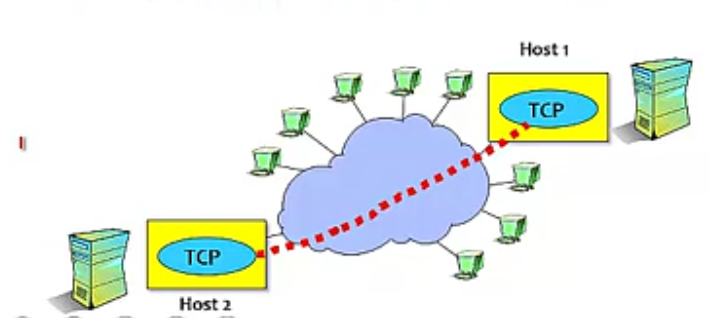
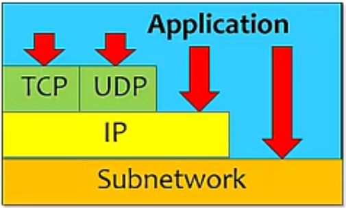
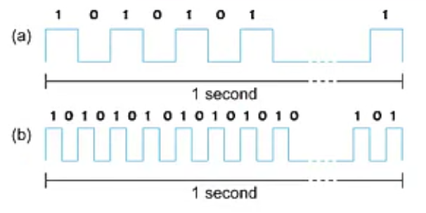

# 网络架构与七层参考模式

## Applications

> Most people konw about the Internet(a computer network) through applications
- World Wide Web
- On line games
- Email(Gmail, hotmail,...)
- Online Social Network(Facebook, Twitter,...)
- Streaming Audio Video (Youbute, pptv, kkbox, ppstream,...)
- File Sharing(dropbox,...)
- Instant Messaging(Skype, IM+, MSNLine, WeChat,...)

- A multimedia application including video conferencing.

- URL

> Uniform Resource Locater, http://domain.ltd

- HTTP

> Hyper Text Transfer Protocol

- TCP

> Transmission Control Protocol

- 17 messages for one URL request
  - 6 to find the IP(Internet Protocol) address
  - 3 for connection establishment of TCP
  - 4 for HTTP request and acknowledgement
    - Request: I got your request and I will send the data
    - Reply: Here is the data you requested; I got the data
  - 4 messages for tearing down TCP connection

## Network Connectivity

### Important terminologies

- Link(电脑与电脑连接的)
- Nodes(电脑，手机等设备)
- Point-to-point(点对点)
- Multiple access（多个设备同事存取link）
- Switched Network
  - Circult Switched(电路交换)
  - Packet Switched(分组交换)
- Packet, message 分组数据，message原始资料
- Store-and-forward 分包存储和转送,手->查表->转送

### Terminologies(contd.)

- Hosts
- Switches
- Spanning tree 生成树
- internetwork 互联网
- Router/gateway
- Host-to-host connectivity
- Address
- Routing
- Unicast/broadcast/multicast
- LAN(Local Area Networks)
- MAN(Metropolitan Area Networks)
- WAN(Wide Area Networks)

### Cost-Effective Resource Sharing

- Resources: links and nodes
- How to share a link?
  - Multiplexing
    - FDM：Frequence Division Multiplexing
      - frequency(平带)/time
    - TDM: Synchronous Time-division Multiplexing
      - Time slots/data transmitted in predetermined slots
      - frequency/time
  - De-multiplexing

- Statistical Multiplexing
  - Data is transmitted based on demand of each flow.
  - What is a flow?
  - Packets vs. Messages
  - FIFO(Queue), Round-Robin(轮循), Priorities(优先权 Quality-of-Service(QoS) 服务质量)
  - Congested? 拥挤的

### Logical Channels

- Logical Channels
  - Application-to-Application communication path or a pipe

### Network Reliability

- Network should hide the errors
- Bits are lost
  - Bit errors(1 to a 0, and vice versa)
  - Burst errors - several consecutive errors
- Packets are lost(Congestion)
- Links and Node failures
- Messsages are delayed
- Messages are delivered out-of-order
- Third parties eavesdrop

## Network Architecture

- Application Programs
- Process-to-process Channels
- Host-to-Host Connectivity
- hardware

### protocols

- Protocol defines the interfaces between
  - the layers in the same system and with
  - the layers of peer system
- Building blocks of a network architecture
- Each protocol ojbect has two different interfaces
  - Service interface: operations on this protocol
  - Peer-to-peer interface: message exchanges with peer

- Protocol Specification: pseudo-code, state transition diagram, message format
- Interoperable: when two or more protocols that implement the specification accurately
- IETF: Internet Engineering Task Force
  - Define Internet standard protocols

### Encapsulation

### OSI Architecture

OSI: Open System Interconnection

### Description of Layers

- Physical Layer(如何将原始资料在 Link 上传输)
  - Handles the transmission of raw bits over a communication link
    - Coaxial cable 同轴线 
    - Twisted pair 双绞线 
    - Optical Fiber 光纤 (不受电磁波干扰)
    - Air space(wireless radio channel) 无线网路（电磁波传输）
  - Different Signal Coding schemes 
  - 同轴线和双绞线容易受电磁波干扰

- Data Link Layer(如何将 frame 传给直接相连的主机或设备)
  - Collects a stream of bits into a frame
  - How to transmit a frame to a directly conencted hsot(destination)
  - MAC (Meda Access Control Protocol)
    - CSMA/CD (IEEE 802.3 Ethernet)
    - CSMA/CA (IEEE 8.2.11 Wireless LAN)
  - Layer 2 devices
  - Switches
  - Bridges

- Network Layer(如何将封包透过 internet 送给目的主机 )
  - How to transmit frames to a host via the Internet?
  - Handles **routing** among nodes within a packet-swiched network
  - Data exchanged between nodes in this layer is called a **packet**
  - IP protocol
  - Routers
  - Routing protocols
    - RIP
    - OSPF
    - BGP
  - Routing Tables

- Transport Layer(提供不同主机 processes 之间的资料传送)
  - implements a process-to-process channel
  - unit of data exchanges in this layer is called a message
  - TCP (Transmission Control Protocol) - Reliable service
  - UDP (User Datagram Protocol) - Unreliable service

- Session Layer
  - Provides a name space that is used **to tie together the potentially different transport streams** that are part of a single application

- Prensentation Layer
  - Concerned about hte **format of data** exchanged between peers

- Application Layer
  - Standardize common type of exchanges
  - FTP/E-mail/DNS/HTTP/Browsers/FB

## Network Performance

- Defined by IETF
- Three main features
  - **Does not imply strict layering**. The application is **free to bypass** the defined transport layers and to directly use IP or other underlying networks.

- Bandwidth
  - Width of the **frequency band**
  - **Number of bits per second** that can be transmitted over a communication link
- 1 Mbps: 1 x 10^6 bits/second
- 1 x 10^-6 seconds to transmit each bit or imagine that a timeline, now each bit occupies 1 micro second space.
- On a 2 Mbps link the width is 0.5 micro second.
- Smaller the width more will be transmisson per unit time.

Bits transmitted at a particular bandwidth can be regarded as having some width:

a. bits transimitted at 1Mbps (each bit 1 us wide)

b. bits transmitted at 2Mbps(eacg bit 0.5 us wide)

**Latency** = Propagation time + transimission time + queuing time(排队时间)

**Propagation time** = distance/speed of light

**Trasmission time** = size/bandwidth

one bit transmission => propagation is important (短资料很快就送完，但需要长时间才能传到对方，资料已送完，但签到资料还未到达对方) Propagation time >> transmission time

Large bytes transmission => bandwidth is important (长资料很慢才能送完，未送完前，前导资料已到对方) Transmisson time >> propagation time

### Delay X Bandwidth

- The channel between a pair of processes can be viewed as a pipe
- Latency(delay): length of the pipe
- Bandwidth: width of the pipe
- Delay x Bandwidth means how many data can be stored in the pipe
- For example, delay of 80 ms and bandwidth of 100 Mbps

80 x 10^3 seconds x 100 x 10^6 bits/second

8 * 10^6 bits = 8 Mbits = 1MB data

- Relative importance of bandwidth and latency depends on application
  - For large file tansfer, bandwidth is critical
  - For small messages(HTTP, NFS, etc.), latency is critical
  - Variance in latency(jitter) can also affect some applications(e.g., audio/video conferencing)
