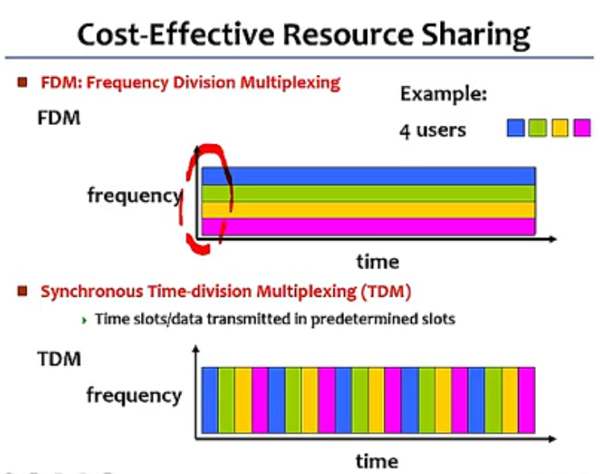
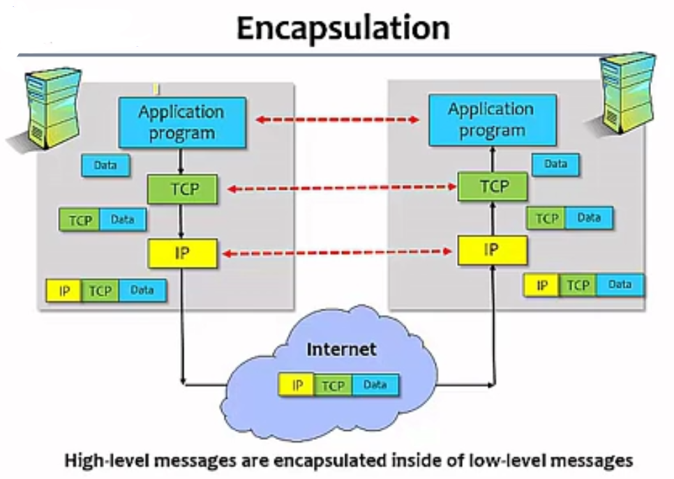

# 网络架构与七层参考模式

## Applications

> Most people konw about the Internet(a computer network) through applications
- World Wide Web
- On line games
- Email(Gmail, hotmail,...)
- Online Social Network(Facebook, Twitter,...)
- Streaming Audio Video (Youbute, pptv, kkbox, ppstream,...)
- File Sharing(dropbox,...)
- Instant Messaging(Skype, IM+, MSNLine, WeChat,...)

- A multimedia application including video conferencing.

- URL

> Uniform Resource Locater, http://domain.ltd

- HTTP

> Hyper Text Transfer Protocol

- TCP

> Transmission Control Protocol

- 17 messages for one URL request
  - 6 to find the IP(Internet Protocol) address
  - 3 for connection establishment of TCP
  - 4 for HTTP request and acknowledgement
    - Request: I got your request and I will send the data
    - Reply: Here is the data you requested; I got the data
  - 4 messages for tearing down TCP connection

## Network Connectivity

### Important terminologies

- Link(电脑与电脑连接的)
- Nodes(电脑，手机等设备)
- Point-to-point(点对点)
- Multiple access（多个设备同事存取link）
- Switched Network
  - Circult Switched(电路交换)
  - Packet Switched(分组交换)
- Packet, message 分组数据，message原始资料
- Store-and-forward 分包存储和转送,手->查表->转送

### Terminologies(contd.)

- Hosts
- Switches
- Spanning tree 生成树
- internetwork 互联网
- Router/gateway
- Host-to-host connectivity
- Address
- Routing
- Unicast/broadcast/multicast
- LAN(Local Area Networks)
- MAN(Metropolitan Area Networks)
- WAN(Wide Area Networks)

### Cost-Effective Resource Sharing

- Resources: links and nodes
- How to share a link?
  - Multiplexing
    - FDM：Frequence Division Multiplexing
      - frequency(平带)/time
    - TDM: Synchronous Time-division Multiplexing
      - Time slots/data transmitted in predetermined slots
      - frequency/time
  - De-multiplexing

- Statistical Multiplexing
  - Data is transmitted based on demand of each flow.
  - What is a flow?
  - Packets vs. Messages
  - FIFO(Queue), Round-Robin(轮循), Priorities(优先权 Quality-of-Service(QoS) 服务质量)
  - Congested? 拥挤的

### Logical Channels

- Logical Channels
  - Application-to-Application communication path or a pipe

### Network Reliability

- Network should hide the errors
- Bits are lost
  - Bit errors(1 to a 0, and vice versa)
  - Burst errors - several consecutive errors
- Packets are lost(Congestion)
- Links and Node failures
- Messsages are delayed
- Messages are delivered out-of-order
- Third parties eavesdrop

## Network Architecture

- Application Programs
- Process-to-process Channels
- Host-to-Host Connectivity
- hardware

### protocols

- Protocol defines the interfaces between
  - the layers in the same system and with
  - the layers of peer system
- Building blocks of a network architecture
- Each protocol ojbect has two different interfaces
  - Service interface: operations on this protocol
  - Peer-to-peer interface: message exchanges with peer

- Protocol Specification: pseudo-code, state transition diagram, message format
- Interoperable: when two or more protocols that implement the specification accurately
- IETF: Internet Engineering Task Force
  - Define Internet standard protocols

### Encapsulation

### OSI Architecture

OSI: Open System Interconnection

## Network Performance
